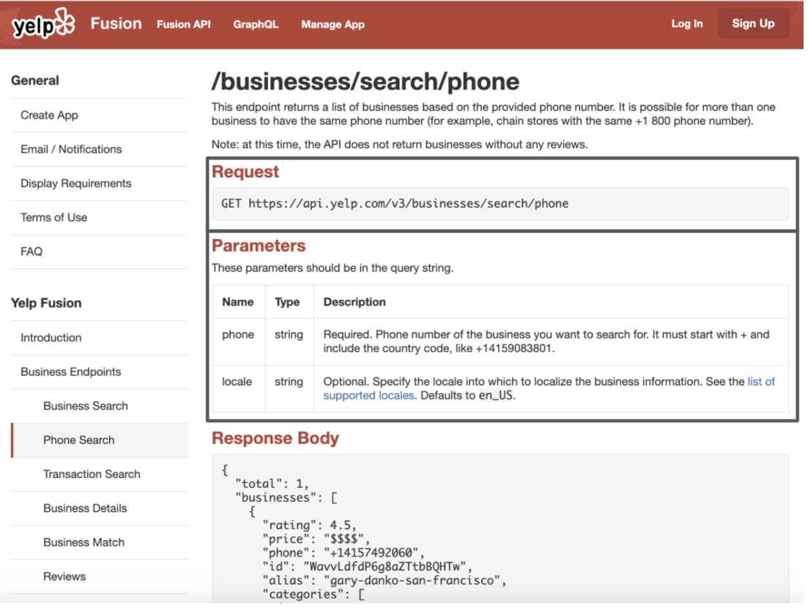

# Setting up the data connector config file
<!-- ALL-CONTRIBUTORS-BADGE:START - Do not remove or modify this section -->

<!-- ALL-CONTRIBUTORS-BADGE:END -->

This README is intended for contributors and developers who want to build your configuration file. In this file, it will go over how to make a configuration file with Yelp's API, specifically an API for phone number searches. 

Read through the Yelp API documentation and review what the available endpoints are, please visit this [link](https://www.yelp.com/developers/documentation/v3/get_started). 

# Inspecting endpoints

“Endpoints are communication channels. When an API interacts with another system, they communicate with each other and allows you to match business data on the information you provide.”

When you decide on an endpoint, explore the page. Under request is the HTTP request method and the specific source. Store the information as it will be used to build the config file. 

In the parameter section, select the targets you want as a response for your app.

“A parameter is an option that can be passed with the endpoint to influence the response”.

# Obtaining an access token
Yelp requires the user to have an access token to make API requests on their behalf. The access token represents the authorization of a specific application to access particular parts of a user's data. To obtain the access token, create an app, enter some information about its use and generate a key, please visit this [link](https://www.yelp.com/developers/documentation/v3/get_started).

Now that you created your token, it’s time to create the config files. 

# The config files
The data connector requires two files to run, meta.json and table.json.

## Create the meta.json file

The meta.json file contains the key value of the table and its name in an array. It tells the connector how many tables are in the data source and which tables to access. The meta.json file needs to manually written.

## Create the businesses.json file

The business file contains information needed to communicate with Yelp’s API. In this file, there is the request and response section. 

## Top Level
### Request:

URL: "https://api.yelp.com/v3/businesses/search/phone"
- Contains the URL path for the API

method: "GET" 
- GET is used to request data from a specified resource, For the Yelp's API request, leave it as GET.

authorization: "Bearer"
- Authorization to ensure that client requests access data securely. The Bearer allows requests to authenticate using an access key, such as a token. For Yelp's API request, leave it as Bearer.

- Note: For other API’s, please read how they may authorize your application. Depending on the method, a different authorization may be required. 

Params: {"phone": true}
- Parameters, or Params, contain the requested criteria to the API. Before creating the config file, the parameters should be selected. Each parameter as a key-value pair where the name is the key and the value is Boolean. If you take a look at the Yelp Phone Search documentation, it shows that phone is a required parameter.
  - A True value refers to the required parameter to query a request. 
  - A False value refers to the optional parameter to query a request. 

### Response:

ctype: "application/json"
- The Content-Type, or ctype, is used to indicate the media type of the resource. A Content-Type header tells the client what the content type of the returned information actually is. With data connector, the contect type is application/json. 
  
tablePath: "$.businesses[*]"
- When the response is received it delievers an array and under the array is the table content. With data connector and Yelp, the tablePath is $.businesses[*].

schema: { }
- After finding table content, it looks at schema.
  
id: {"target": "$.id", "type": "string"}
- The schema will be read until all elements of the business array received. ID is at the root of the first row of the business array, and it will access the ID attribute. 

- To build the schema, you would need to review the response section of the specific endpoint page.  

The user selects the responses they are interested in and sets them up in the appropriate format. Take a look at the response section of the page. The target is the response name, and the type is the data format response generated. 

Once the user sets up the appropriate responses in the Json file then the user can start up the data connection. 

# That's all for now

Please visit the other tutorials that are available if you are interested in setting up a data connector.

## Contributors ✨

Thanks goes to these wonderful people ([emoji key](https://allcontributors.org/docs/en/emoji-key)):

<!-- ALL-CONTRIBUTORS-LIST:START - Do not remove or modify this section -->
<!-- prettier-ignore-start -->
<!-- markdownlint-disable -->
<table>
  <tr>
    <td align="center"><a href="http://wooya.me"> <b>Weiyuan Wu</b></a> <a href="https://github.com/sfu-db/DataConnectorConfigs/commits?author=dovahcrow" title="Code">💻</a> <a href="#maintenance-dovahcrow" title="Maintenance">🚧</a></td>
    <td align="center"><a href="http://www.sfu.ca/~peiw/"> <b>peiwangdb</b></a> <a href="https://github.com/sfu-db/DataConnectorConfigs/commits?author=peiwangdb" title="Code">💻</a> <a href="#maintenance-peiwangdb" title="Maintenance">🚧</a></td>
    <td align="center"><a href="https://github.com/nick-zrymiak"> <b>nick-zrymiak</b></a> <a href="https://github.com/sfu-db/DataConnectorConfigs/commits?author=nick-zrymiak" title="Code">💻</a></td>
    <td align="center"><a href="https://www.pallavibharadwaj.com"> <b>Pallavi Bharadwaj</b></a> <a href="https://github.com/sfu-db/DataConnectorConfigs/commits?author=pallavibharadwaj" title="Code">💻</a></td>
    <td align="center"><a href="https://www.linkedin.com/in/hilal-asmat/"> <b>Hilal Asmat</b></a> <a href="https://github.com/sfu-db/DataConnectorConfigs/commits?author=h-asmat" title="Documentation">📖</a></td>
  </tr>
</table>

<!-- markdownlint-enable -->
<!-- prettier-ignore-end -->
<!-- ALL-CONTRIBUTORS-LIST:END -->

This project follows the [all-contributors](https://github.com/all-contributors/all-contributors) specification. Contributions of any kind welcome!