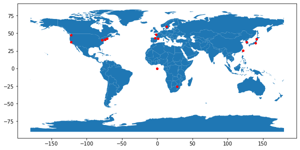

# Data Collection From Web APIs

<!-- ALL-CONTRIBUTORS-BADGE:START - Do not remove or modify this section -->
[](#contributors-)
<!-- ALL-CONTRIBUTORS-BADGE:END -->

A curated list of example code to collect data from Web APIs using DataPrep.Connector.

## How to Contribute?
You can contribute to this project in two ways. Please check the [contributing guide](CONTRIBUTING.md).
1. Add your example code on this page
2. Add a new configuration file to this repo

## Why Contribute?
* Your contribution will benefit [~100K DataPrep users](https://github.com/sfu-db/dataprep).
* Your contribution will be recoginized on [Contributors](#contributors-).

## Index
* [Art](#art)
* [Business](#business)
* [Calendar](#calendar)
* [Crime](#crime)
* [Finance](#finance)
* [Geocoding](#geocoding)
* [Jobs](#jobs)
* [Lifestyle](#lifestyle)
* [Music](#music)
* [Networking](#networking)
* [News](#news)
* [Science](#science)
* [Shopping](#shopping)
* [Social](#social)
* [Sports](#sports)
* [Travel](#travel)
* [Video](#video)
* [Weather](#weather)

### Art

#### [Harvard Art Museum](./harvardartmuseum) -- Collect Museums' Collection Data

<details>
  <summary>Find the objects with dog in their titles and were made in 1990.</summary>

  ```python
from dataprep.connector import connect

# You can get ”api_key“ by following https://docs.google.com/forms/d/e/1FAIpQLSfkmEBqH76HLMMiCC-GPPnhcvHC9aJS86E32dOd0Z8MpY2rvQ/viewform
dc = connect('harvardartmuseum', _auth={'access_token': api_key})

df = await dc.query('object', title='dog', yearmade=1990)
df[['title', 'division', 'classification', 'technique', 'department', 'century', 'dated']]
  ```

|      | title                       | division                    | classification | technique            | department                | century      | dated |
| ---- | --------------------------- | --------------------------- | -------------- | -------------------- | ------------------------- | ------------ | ----- |
| 0    | Paris (black dog on street) | Modern and Contemporary Art | Photographs    | Gelatin silver print | Department of Photographs | 20th century | 1990s |
| 1    | Pregnant Woman with Dog     | Modern and Contemporary Art | Photographs    | Gelatin silver print | Department of Photographs | 20th century | 1990  |
| 2    | Pompeii Dog                 | Modern and Contemporary Art | Prints         | Drypoint             | Department of Prints      | 20th century | 1990  |

</details>

<details>
  <summary>Find 10 people that are Dutch.</summary>

  ```python
from dataprep.connector import connect

# You can get ”api_key“ by following https://docs.google.com/forms/d/e/1FAIpQLSfkmEBqH76HLMMiCC-GPPnhcvHC9aJS86E32dOd0Z8MpY2rvQ/viewform
dc = connect('harvardartmuseum', _auth={'access_token': api_key})

df = await dc.query('person', q='culture:Dutch', size=10)
df[['display name', 'gender', 'culture', 'display date', 'object count', 'birth place', 'death place']]
  ```

|      | display name                    | gender  | culture | display date   | object count | birth place                      | death place            |
| ---- | ------------------------------- | ------- | ------- | -------------- | ------------ | -------------------------------- | ---------------------- |
| 0    | Joris Abrahamsz. van der Haagen | unknown | Dutch   | 1615 - 1669    | 7            | Arnhem or Dordrecht, Netherlands | The Hague, Netherlands |
| 1    | François Morellon de la Cave    | unknown | Dutch   | 1723 - 65      | 1            | None                             | None                   |
| 2    | Cornelis Vroom                  | unknown | Dutch   | 1590/92 - 1661 | 3            | Haarlem(?), Netherlands          | Haarlem, Netherlands   |
| 3    | Constantijn Daniel van Renesse  | unknown | Dutch   | 1626 - 1680    | 2            | Maarssen                         | Eindhoven              |
| 4    | Dirck Dalens, the Younger       | unknown | Dutch   | 1654 - 1688    | 3            | Amsterdam, Netherlands           | Amsterdam, Netherlands |

</details>

<details>
  <summary>Find all exhibitions that take place at a Harvard Art Museums venue after 2020-01-01.</summary>

```python
from dataprep.connector import connect

# You can get ”api_key“ by following https://docs.google.com/forms/d/e/1FAIpQLSfkmEBqH76HLMMiCC-GPPnhcvHC9aJS86E32dOd0Z8MpY2rvQ/viewform
dc = connect('harvardartmuseum', _auth={'access_token': api_key})

df = await dc.query('exhibition', venue='HAM', after='2020-01-01')
df
```

|      | title                                                   | begin date | end date   | url                                                      |
| ---- | ------------------------------------------------------- | ---------- | ---------- | -------------------------------------------------------- |
| 0    | Painting Edo: Japanese Art from the Feinberg Collection | 2020-02-14 | 2021-07-18 | https://www.harvardartmuseums.org/visit/exhibitions/5909 |

</details>

<details>
  <summary>Find 5 records for publications that were published in 2013.</summary>

  ```python
from dataprep.connector import connect

# You can get ”api_key“ by following https://docs.google.com/forms/d/e/1FAIpQLSfkmEBqH76HLMMiCC-GPPnhcvHC9aJS86E32dOd0Z8MpY2rvQ/viewform
dc = connect('harvardartmuseum', _auth={'access_token': api_key})

df = await dc.query('publication', q='publicationyear:2013', size=5)
df[['title','publication date','publication place','format']]
  ```

|      | title                                             | publication date | publication place | format                   |
| ---- | ------------------------------------------------- | ---------------- | ----------------- | ------------------------ |
| 0    | 19th Century Paintings, Drawings & Watercolours   | January 23, 2013 | London            | Auction/Dealer Catalogue |
| 1    | "With Éclat" The Boston Athenæum and the Orig...  | 2013             | Boston, MA        | Book                     |
| 2    | "Review: Fragonard's Progress of Love at the F... | 2013             | London            | Article/Essay            |
| 3    | Alternative Narratives                            | February 2013    | None              | Article/Essay            |
| 4    | Victorian & British Impressionist Art             | July 11, 2013    | London            | Auction/Dealer Catalogue |

</details>

<details>
  <summary>Find 5 galleries that are on floor (Level) 2 in the Harvard Art Museums building.</summary>

  ```python
from dataprep.connector import connect

# You can get ”api_key“ by following https://docs.google.com/forms/d/e/1FAIpQLSfkmEBqH76HLMMiCC-GPPnhcvHC9aJS86E32dOd0Z8MpY2rvQ/viewform
dc = connect('harvardartmuseum', _auth={'access_token': api_key})

df = await dc.query('gallery', floor=2, size=5)
df[['id','name','theme','object count']]
  ```

|      | id   | name                                         | theme                                             | object count |
| ---- | ---- | -------------------------------------------- | ------------------------------------------------- | ------------ |
| 0    | 2200 | European and American Art, 17th–19th century | The Emergence of Romanticism in Early Nineteen... | 20           |
| 1    | 2210 | West Arcade                                  | None                                              | 6            |
| 2    | 2340 | European and American Art, 17th–19th century | The Silver Cabinet: Art and Ritual, 1600–1850     | 73           |
| 3    | 2460 | East Arcade                                  | None                                              | 2            |
| 4    | 2700 | European and American Art, 19th century      | Impressionism and the Late Nineteenth Century     | 19           |

</details>


### Business

#### [Yelp](./yelp) -- Collect Local Business Data
<details>
  <summary>What's the phone number of Capilano Suspension Bridge Park?</summary>

```python
from dataprep.connector import connect

# You can get ”yelp_access_token“ by following https://www.yelp.com/developers/documentation/v3/authentication
conn_yelp = connect("yelp", _auth={"access_token":yelp_access_token}, _concurrency = 5)

df = await conn_yelp.query("businesses", term = "Capilano Suspension Bridge Park", location = "Vancouver", _count = 1)

df[["name","phone"]]
```

| id  | name                            | phone           |
| --- | ------------------------------- | --------------- |
| 0   | Capilano Suspension Bridge Park | +1 604-985-7474 |

  </details>
<details>
  <summary>Which yoga store has the highest review count in Vancouver?</summary>

```python
from dataprep.connector import connect

# You can get ”yelp_access_token“ by following https://www.yelp.com/developers/documentation/v3/authentication
conn_yelp = connect("yelp", _auth={"access_token":yelp_access_token}, _concurrency = 1)

  # Check all supported categories: https://www.yelp.ca/developers/documentation/v3/all_category_list
df = await conn_yelp.query("businesses", categories = "yoga", location = "Vancouver", sort_by = "review_count", _count = 1)
df[["name", "review_count"]]
```

| id  | name                | review_count |
| --- | ------------------- | ------------ |
| 0   | YYOGA Downtown Flow | 107          |

  </details>  

<details>
  <summary>How many Starbucks stores in Seattle and where are they?</summary>

  ```python
  from dataprep.connector import connect

  # You can get ”yelp_access_token“ by following https://www.yelp.com/developers/documentation/v3/authentication
  conn_yelp = connect("yelp", _auth={"access_token":yelp_access_token}, _concurrency = 5)
  df = await conn_yelp.query("businesses", term = "Starbucks", location = "Seattle", _count = 1000)

  # Remove irrelevant data
  df = df[(df['city'] == 'Seattle') & (df['name'] == 'Starbucks')]
  df[['name', 'address1', 'city', 'state', 'country', 'zip_code']].reset_index(drop=True)
  ```
| id  | name      | address1                 | city    | state | country | zip_code |
| --- | --------- | ------------------------ | ------- | ----- | ------- | -------- |
| 0   | Starbucks | 515 Westlake Ave N       | Seattle | WA    | US      | 98109    |
| 1   | Starbucks | 442 Terry Avenue N       | Seattle | WA    | US      | 98109    |
| ... | .......   | .......                  | ......  | ..    | ..      | ....     |
| 126 | Starbucks | 17801 International Blvd | Seattle | WA    | US      | 98158    |

</details>
<details>
  <summary>What are the ratings for a list of resturants?</summary>

  ```python
  from dataprep.connector import connect
  import pandas as pd
  import asyncio
  # You can get ”yelp_access_token“ by following https://www.yelp.com/developers/documentation/v3/authentication
  conn_yelp = connect("yelp", _auth={"access_token":yelp_access_token}, _concurrency = 5)

  names = ["Miku", "Boulevard", "NOTCH 8", "Chambar", "VIJ’S", "Fable", "Kirin Restaurant", "Cafe Medina", \
   "Ask for Luigi", "Savio Volpe", "Nicli Pizzeria", "Annalena", "Edible Canada", "Nuba", "The Acorn", \
   "Lee's Donuts", "Le Crocodile", "Cioppinos", "Six Acres", "St. Lawrence", "Hokkaido Santouka Ramen"]

  query_list = [conn_yelp.query("businesses", term=name, location = "Vancouver", _count=1) for name in names]
  results = asyncio.gather(*query_list)
  df = pd.concat(await results)
  df[["name", "rating", "city"]].reset_index(drop=True)
  ```
| ID  | Name                           | Rating | City      |
| --- | ------------------------------ | ------ | --------- |
| 0   | Miku                           | 4.5    | Vancouver |
| 1   | Boulevard Kitchen & Oyster Bar | 4.0    | Vancouver |
| ... | ...                            | ...    | ...       |
| 20  | Hokkaido Ramen Santouka        | 4.0    | Vancouver |
</details>

#### [Hunter](./hunter) -- Collect and Verify Professional Email Addresses
<details>
<summary>Who are executives of Asana and what are their emails?</summary>

```python
from dataprep.connector import connect

# You can get ”hunter_access_token“ by registering as a developer https://hunter.io/users/sign_up
conn_hunter = connect("hunter", _auth={"access_token":'hunter_access_token'})

df = await conn_hunter.query('all_emails', domain='asana.com', _count=10)

df[df['department']=='executive']
```


<div>
<table border="1" class="dataframe">
<thead>
<tr style="text-align: right;">
<th></th>
<th>first_name</th>
<th>last_name</th>
<th>email</th>
<th>position</th>
<th>department</th>
</tr>
</thead>
<tbody>
<tr>
<th>0</th>
<td>Dustin</td>
<td>Moskovitz</td>
<td>dustin@asana.com</td>
<td>Cofounder</td>
<td>executive</td>
</tr>
<tr>
<th>1</th>
<td>Stephanie</td>
<td>Heß</td>
<td>shess@asana.com</td>
<td>CEO</td>
<td>executive</td>
</tr>
<tr>
<th>2</th>
<td>Erin</td>
<td>Cheng</td>
<td>erincheng@asana.com</td>
<td>Strategic Initiatives</td>
<td>executive</td>
</tr>
</tbody>
</table>
</div>


</details>
<details>
<summary>What is Dustin Moskovitz's email?</summary>

```python
from dataprep.connector import connect

# You can get ”hunter_access_token“ by registering as a developer https://hunter.io/users/sign_up
conn_hunter = connect("hunter", _auth={"access_token":'hunter_access_token'})

df = await conn_hunter.query("individual_email", full_name='dustin moskovitz', domain='asana.com')

df
```


<div>
<table border="1" class="dataframe">
<thead>
<tr style="text-align: right;">
<th></th>
<th>first_name</th>
<th>last_name</th>
<th>email</th>
<th>position</th>
</tr>
</thead>
<tbody>
<tr>
<th>0</th>
<td>Dustin</td>
<td>Moskovitz</td>
<td>dustin@asana.com</td>
<td>Cofounder</td>
</tr>
</tbody>
</table>
</div>
</details>  

<details>
<summary>Are the emails of Asana executives valid?</summary>

```python
from dataprep.connector import connect

# You can get ”hunter_access_token“ by registering as a developer https://hunter.io/users/sign_up
conn_hunter = connect("hunter", _auth={"access_token":'hunter_access_token'})

employees = await conn_hunter.query("all_emails", domain='asana.com', _count=10)
executives = employees.loc[employees['department']=='executive']
emails = executives[['email']]

for email in emails.iterrows():
status = await conn_hunter.query("email_verifier", email=email[1][0])
emails['status'] = status

emails
```

<div>
<table border="1" class="dataframe">
<thead>
<tr style="text-align: right;">
<th></th>
<th>email</th>
<th>status</th>
</tr>
</thead>
<tbody>
<tr>
<th>0</th>
<td>dustin@asana.com</td>
<td>valid</td>
</tr>
<tr>
<th>3</th>
<td>shess@asana.com</td>
<td>NaN</td>
</tr>
<tr>
<th>4</th>
<td>erincheng@asana.com</td>
<td>NaN</td>
</tr>
</tbody>
</table>
</div>

</details>
<details>
<summary>How many available requests do I have left?</summary>

```python
from dataprep.connector import connect

# You can get ”hunter_access_token“ by registering as a developer https://hunter.io/users/sign_up
conn_hunter = connect("hunter", _auth={"access_token":'hunter_access_token'})

df = await conn_hunter.query("account")
df
```


<div>
<table border="1" class="dataframe">
<thead>
<tr style="text-align: right;">
<th></th>
<th>requests available</th>
</tr>
</thead>
<tbody>
<tr>
<th>0</th>
<td>19475</td>
</tr>
</tbody>
</table>
</div>
</details>

<details>
<summary>What are the counts of each level of seniority of Intercom employees?</summary>

```python
from dataprep.connector import connect

# You can get ”hunter_access_token“ by registering as a developer https://hunter.io/users/sign_up
conn_hunter = connect("hunter", _auth={"access_token":'hunter_access_token'})

df = await conn_hunter.query("email_count", domain='intercom.io')
df.drop('total', axis=1)
```


<div>
<table border="1" class="dataframe">
<thead>
<tr style="text-align: right;">
<th></th>
<th>junior</th>
<th>senior</th>
<th>executive</th>
</tr>
</thead>
<tbody>
<tr>
<th>0</th>
<td>0</td>
<td>2</td>
<td>2</td>
</tr>
</tbody>
</table>
</div>
</details>

### Calendar

#### [Holiday](./holiday) -- Collect Holiday, Workday Data

<details>
  <summary>What are the supported countries, their country codes and languages supported?</summary>


```python
from dataprep.connector import connect

# You can get ”holiday_key“ by following https://holidayapi.com/docs
dc = connect('holiday', _auth={'access_token': holiday_key})

df = await dc.query("country")
df
```

|      | code | name                 | languages |
| ---- | ---- | -------------------- | --------- |
| 0    | AD   | Andorra              | ['ca'     |
| 1    | AE   | United Arab Emirates | ['ar']    |
| ..   | ..   | ...                  | ...       |
| 249  | ZW   | Zimbabwe             | ['en']    |

</details>

<details>
  <summary>What are the public holidays of Canada in 2020?</summary>


```python
from dataprep.connector import connect

# You can get ”holiday_key“ by following https://holidayapi.com/docs
dc = connect('holiday', _auth={'access_token': holiday_key})

df = await dc.query('holiday', country='CA', year=2020, public=True)
df
```

|      | name           | date       | public | observed   | weekday   |
| ---- | -------------- | ---------- | ------ | ---------- | --------- |
| 0    | New Year's Day | 2020-01-01 | True   | 2020-01-01 | Wednesday |
| 1    | Good Friday    | 2020-04-10 | True   | 2020-04-10 | Friday    |
| 2    | Victoria Day   | 2020-05-18 | True   | 2020-05-18 | Monday    |
| 3    | Canada Day     | 2020-07-01 | True   | 2020-07-01 | Wednesday |
| 4    | Labor Day      | 2020-09-07 | True   | 2020-09-07 | Monday    |
| 5    | Christmas Day  | 2020-12-25 | True   | 2020-12-25 | Friday    |


</details>

<details>
  <summary>Which day is the 100th workday starting from 2020-01-01, in Canada?</summary>


```python
from dataprep.connector import connect

# You can get ”holiday_key“ by following https://holidayapi.com/docs
dc = connect('holiday', _auth={'access_token': holiday_key})

df = await dc.query('workday', country='CA', start='2020-01-01', days=100)
df
```

|      | date      | weekday |
| ---- | --------- | ------- |
| 0    | 2020-5-22 | Friday  |

</details>

### Crime

#### [JailBase](./jailbase) -- Collect Prisoner Data
<details>
<summary>What is the URL for the mugshot of Almondo Smith?</summary>

```python
# You can get ”jailbase_access_token“ by registering as a developer https://rapidapi.com/JailBase/api/jailbase
dc = connect('jailbase', _auth={'access_token':jailbase_access_token})

df = await dc.query('search', source_id='wi-wcsd', last_name='smith', first_name='almondo')

df['mugshot'][0]
```


'https://imgstore.jailbase.com/small/arrested/wi-wcsd/2017-12-29/almondo-smith-679063bf90e389938d70b0b49caf7944.pic1.jpg'

</details>
<details>
<summary>Who were the 10 most recently arrested people by Wood County Sheriff's Department?</summary>

```python
# You can get ”jailbase_access_token“ by registering as a developer https://rapidapi.com/JailBase/api/jailbase
dc = connect('jailbase', _auth={'access_token':jailbase_access_token})
sources = await dc.query('sources')
department = sources[sources['name']=='Wood County Sheriff\'s Dept']

df = await dc.query('recent', source_id=department['source_id'].values[0])

df
```


<div>
<table border="1" class="dataframe">
<thead>
<tr style="text-align: right;">
<th></th>
<th>id</th>
<th>name</th>
<th>mugshot</th>
<th>charges</th>
<th>more_info_url</th>
</tr>
</thead>
<tbody>
<tr>
<th>0</th>
<td>23917656</td>
<td>Curtis Joseph</td>
<td>https://imgstore.jailbase.com/small/arrested/w...</td>
<td>[[]]</td>
<td>http://www.jailbase.com/en/wi-wcsdcurtis-josep...</td>
</tr>
<tr>
<th>1</th>
<td>23917654</td>
<td>Taner Summers</td>
<td>https://imgstore.jailbase.com/small/arrested/w...</td>
<td>[[]]</td>
<td>http://www.jailbase.com/en/wi-wcsdtaner-summer...</td>
</tr>
<tr>
<th>2</th>
<td>23901411</td>
<td>Maryann Randolph</td>
<td>https://imgstore.jailbase.com/small/arrested/w...</td>
<td>[[]]</td>
<td>http://www.jailbase.com/en/wi-wcsdmaryann-rand...</td>
</tr>
<tr>
<th>3</th>
<td>23821284</td>
<td>Antonia Cinodijay</td>
<td>https://imgstore.jailbase.com/widgets/NoMug.gif</td>
<td>[[]]</td>
<td>http://www.jailbase.com/en/wi-wcsdantonia-cino...</td>
</tr>
<tr>
<th>4</th>
<td>23821280</td>
<td>Deangelo Barker</td>
<td>https://imgstore.jailbase.com/small/arrested/w...</td>
<td>[[]]</td>
<td>http://www.jailbase.com/en/wi-wcsddeangelo-bar...</td>
</tr>
<tr>
<th>5</th>
<td>23811811</td>
<td>Tekeisha Faucibus</td>
<td>https://imgstore.jailbase.com/small/arrested/w...</td>
<td>[[]]</td>
<td>http://www.jailbase.com/en/wi-wcsdtekeisha-fau...</td>
</tr>
<tr>
<th>6</th>
<td>23811810</td>
<td>Tariq Nunoke</td>
<td>https://imgstore.jailbase.com/small/arrested/w...</td>
<td>[[]]</td>
<td>http://www.jailbase.com/en/wi-wcsdtariq-nunoke...</td>
</tr>
<tr>
<th>7</th>
<td>23811808</td>
<td>Sarah Jusakaja</td>
<td>https://imgstore.jailbase.com/small/arrested/w...</td>
<td>[[]]</td>
<td>http://www.jailbase.com/en/wi-wcsdsarah-jusaka...</td>
</tr>
<tr>
<th>8</th>
<td>23791805</td>
<td>Angela Burch</td>
<td>https://imgstore.jailbase.com/small/arrested/w...</td>
<td>[[]]</td>
<td>http://www.jailbase.com/en/wi-wcsdangela-burch...</td>
</tr>
<tr>
<th>9</th>
<td>23775367</td>
<td>Suzanne Nicholson</td>
<td>https://imgstore.jailbase.com/small/arrested/w...</td>
<td>[[]]</td>
<td>http://www.jailbase.com/en/wi-wcsdsuzanne-nich...</td>
</tr>
</tbody>
</table>
</div>

</details>
<details>
<summary>How many police offices are in each US state in the JailBase system?</summary>

```python
# You can get ”jailbase_access_token“ by registering as a developer https://rapidapi.com/JailBase/api/jailbase
dc = connect('jailbase', _auth={'access_token':jailbase_access_token})

df = await dc.query('sources')

state_counts = df['state'].value_counts()
state_counts
```


    North Carolina    81
    Kentucky          75
    Missouri          73
    Arkansas          70
    Iowa              67
    Texas             57
    Virginia          47
    Florida           46
    Mississippi       44
    Indiana           38
    New York          37
    South Carolina    35
    Ohio              29
    Colorado          27
    Tennessee         26
    Alabama           26
    Idaho             23
    New Mexico        18
    California        18
    Michigan          17
    Georgia           17
    Illinois          14
    Washington        13
    Wisconsin         11
    Oregon            10
    Nevada             9
    Arizona            9
    Louisiana          8
    New Jersey         7
    Oklahoma           6
    Utah               5
    Minnesota          5
    Pennsylvania       4
    Maryland           4
    Kansas             3
    North Dakota       3
    South Dakota       2
    Wyoming            2
    Alaska             1
    West Virginia      1
    Nebraska           1
    Montana            1
    Connecticut        1
    Name: state, dtype: int64


</details>


### Finance

#### [Finnhub](./finnhub) -- Collect Financial, Market, Economic Data
<details>
  <summary>How to get a list of cryptocurrencies and their exchanges</summary>

```python
import pandas as pd
from dataprep.connector import connect

# You can get ”finnhub_access_token“ by following https://finnhub.io/
conn_finnhub = connect("finnhub", _auth={"access_token":finnhub_access_token}, update=True)

df = await conn_finnhub.query('crypto_exchange')
exchanges = df['exchange'].to_list()
symbols = []
for ex in exchanges:
    data = await df.query('crypto_symbols', exchange=ex)
    symbols.append(data)
df_symbols = pd.concat(symbols)
df_symbols
```

| id     | description       | displaySymbol	              | symbol           |
| ------ | ----------------- | ------------------------------ | ---------------  |
| 0      | Binance FRONT/ETH | FRONT/ETH	                  | BINANCE:FRONTETH |
| 1      | Binance ATOM/BUSD | ATOM/BUSD	                  | BINANCE:ATOMBUSD |
| ...    | ...           	 | ...   	                      | ...              |
| 281    | Poloniex AKRO/BTC | AKRO/BTC                       | POLONIEX:BTC_AKRO|
</details>

<details>
  <summary>Which ipo in the current month has the highest total share values?</summary>

```python
import calendar
from datetime import datetime
from dataprep.connector import connect

# You can get ”finnhub_access_token“ by following https://finnhub.io/
conn_finnhub = connect("finnhub", _auth={"access_token":finnhub_access_token}, update=True)

today = datetime.today()
days_in_month = calendar.monthrange(today.year, today.month)[1]
date_from = today.replace(day=1).strftime('%Y-%m-%d')
date_to = today.replace(day=days_in_month).strftime('%Y-%m-%d')
ipo_df = await conn_finnhub.query('ipo_calender', from_=date_from, to=date_to)
ipo_df[ipo_df['totalSharesValue'] == ipo_df['totalSharesValue'].max()]
```
| id | date        | exchange    | name                            | numberOfShares | ...  | totalSharesValue  |
|--- | ----------- | ----------- | ------------------------------- | -------------- | ---  | ----------------- |
|  5 | 2021-02-03  | NYSE        | TELUS International (Cda) Inc.  | 33333333       | ...  | 9.58333e+08       |
</details>

<details>
  <summary>What are the average acutal earnings from the last 4 seasons of a list of 10 popular stocks?</summary>

```python
import asyncio
import pandas as pd
from dataprep.connector import connect

# You can get ”finnhub_access_token“ by following https://finnhub.io/
conn_finnhub = connect("finnhub", _auth={"access_token":finnhub_access_token}, update=True)

stock_list = ['TSLA', 'AAPL', 'WMT', 'GOOGL', 'FB', 'MSFT', 'COST', 'NVDA', 'JPM', 'AMZN']
query_list = [conn_finnhub.query('earnings', symbol=symbol) for symbol in stock_list]
query_results = asyncio.gather(*query_list)
stocks_df = pd.concat(await query_results)
stocks_df = stocks_df.groupby('symbol', as_index=False).agg({'actual': ['mean']})
stocks_df.columns = stocks_df.columns.get_level_values(0)
stocks_df = stocks_df.sort_values(by='actual', ascending=False).rename(columns={'actual': 'avg_actual'})
stocks_df.reset_index(drop=True)
```

| id | symbol   | avg_actual    |
|--- | ---------| ------------- |
|  0 | GOOGL    | 12.9375       |
|  1 | AMZN     | 8.5375        |
|  2 | FB       | 2.4475        |
| .. | ...      | ...           |
|  9 | TSLA     | 0.556         |
</details>

<details>
  <summary>What is the earnings of last 4 quarters of a given company? (e.g. TSLA)</summary>

```python
from dataprep.connector import connect
from datetime import datetime, timedelta, timezone

# You can get ”finnhub_access_token“ by following https://finnhub.io/
conn_finnhub = connect("finnhub", _auth={"access_token":finnhub_access_token}, update=True)

today = datetime.now(tz=timezone.utc)
oneyear = today - timedelta(days = 365)
start = int(round(oneyear.timestamp()))

result = await conn_finnhub.query('earnings_calender', symbol='TSLA', from_=start, to=today)
result = result.set_index('date')
result
```
| id | date       |   epsActual |   epsEstimate | hour   |   quarter | ... | symbol   |   year |
|:---|:-----------|------------:|--------------:|:-------|----------:| --- |:---------|-------:|
| 0  | 2021-01-27 |       0.8   |     1.37675   | amc    |         4 | ... | TSLA     |   2020 |
| 1  | 2020-10-21 |       0.76  |     0.600301  | amc    |         3 | ... | TSLA     |   2020 |
| 2  | 2020-07-22 |       0.436 |    -0.0267036 | amc    |         2 | ... | TSLA     |   2020 |
| .. | ...        | ...         | ...           | ...    | ...       | ... | ...      | ...    |
| 3  | 2011-02-15 |      -0.094 |    -0.101592  | amc    |         4 | ... | TSLA     |   2010 |

</details>

#### [CoinGecko](./coingecko) -- Collect Cryptocurrency Data

<details>
  <summary>What are the 10 cryptocurrencies with highest market cap and their current information?</summary>

```python
from dataprep.connector import connect

conn_coingecko = connect("coingecko")
df = await conn_coingecko.query('markets', vs_currency='usd', order='market_cap_desc', per_page=10, page=1)
df
```
|    | name         | symbol   |   current_price |   market_cap |   market_cap_rank |     high_24h |      low_24h |   price_change_24h |   price_change_percentage_24h |   market_cap_change_24h |   market_cap_change_percentage_24h | last_updated             |
|---:|:-------------|:---------|----------------:|-------------:|------------------:|-------------:|-------------:|-------------------:|------------------------------:|------------------------:|-----------------------------------:|:-------------------------|
|  0 | Bitcoin      | btc      |    36811        |  6.86613e+11 |                 1 | 37153        | 35344        |      1440.68       |                       4.0731  |             3.10933e+10 |                            4.7433  | 2021-02-03T19:24:09.271Z |
|  1 | Ethereum     | eth      |     1628.99     |  1.87035e+11 |                 2 |  1645.73     |  1486.42     |       132.91       |                       8.88404 |             1.64296e+10 |                            9.63018 | 2021-02-03T19:22:32.413Z |
| .. | ...          | ...      |  ...            |  ...         |               ... |   ...        |     ...      |        ...         |                           ... |                     ... |                                ... |                      ... |
|  9 | Binance Coin | bnb      |       51.47     |  7.60256e+09 |                10 |    51.63     |    49.76     |         1.24       |                       2.47631 |             1.64863e+08 |                            2.21659 | 2021-02-03T19:25:45.456Z |
</details>

<details>
  <summary>What are the cryptocurrencies with highest increasing and decreasing percentage?</summary>

```python
from dataprep.connector import connect

conn_coingecko = connect("coingecko")
df = await conn_coingecko.query('markets', vs_currency='usd', per_page=1000, page=1)
df = df.sort_values(by=['price_change_percentage_24h']).reset_index(drop=True).dropna()
print("Coin with highest decreasing percetage: {}, which decreases {}%".format(df['name'].iloc[0], df['price_change_percentage_24h'].iloc[0]))
print("Coin with highest increasing percetage: {}, which increases {}%".format(df['name'].iloc[-1], df['price_change_percentage_24h'].iloc[-1]))
```
Coin with the highest decreasing percentage: `PancakeSwap`, which decreases `-13.79622%`

Coin with the highest increasing percentage: `StormX`, which increases `101.24182%`
</details>

<details>
  <summary>Which cryptocurrencies are trending in CoinGecko?</summary>

```python
from dataprep.connector import connect

conn_coingecko = connect("coingecko")
df = await conn_coingecko.query('trend')
df
```
|    | id                | name        | symbol   |   market_cap_rank |   score |
|---:|:------------------|:------------|:---------|------------------:|--------:|
|  0 | bao-finance       | Bao Finance | BAO      |               175 |       0 |
|  1 | milk2             | MILK2       | MILK2    |               634 |       1 |
|  2 | unitrade          | Unitrade    | TRADE    |               529 |       2 |
|  3 | pancakeswap-token | PancakeSwap | CAKE     |               110 |       3 |
|  4 | fsw-token         | Falconswap  | FSW      |               564 |       4 |
|  5 | zeroswap          | ZeroSwap    | ZEE      |               550 |       5 |
|  6 | storm             | StormX      | STMX     |               211 |       6 |

</details>

<details>
  <summary>What are the 10 US exchanges with highest trade volume in the past 24 hours?</summary>

```python
from dataprep.connector import connect

conn_coingecko = connect("coingecko")
df = await conn_coingecko.query('exchanges')
result = df[df['country']=='United States'].reset_index(drop=True).head(10)
result
```
|    | id         | name         |   year_established | ... |   trade_volume_24h_btc_normalized |
|---:|:-----------|:-------------|-------------------:|:----|----------------------------------:|
|  0 | gdax       | Coinbase Pro |               2012 | ... |                         90085.6   |
|  1 | kraken     | Kraken       |               2011 | ... |                         48633.1   |
|  2 | binance_us | Binance US   |               2019 | ... |                         7380.83   |
| .. | ...        | ...          |                ... | ... | ...                               |

</details>

<details>
  <summary>What are the 3 latest traded derivatives with perpetual contract?</summary>

```python
from dataprep.connector import connect
import pandas as pd

conn_coingecko = connect("coingecko")
df = await conn_coingecko.query('derivatives')
perpetual_df = df[df['contract_type'] == 'perpetual'].reset_index(drop=True)
perpetual_df['last_traded_at'] = pd.to_datetime(perpetual_df['last_traded_at'], unit='s')
perpetual_df.sort_values(by=['last_traded_at'], ascending=False).head(3).reset_index(drop=True)
```
|    | market         | symbol     | index_id   | contract_type   |         index |     basis |   funding_rate |   open_interest |       volume_24h | last_traded_at      |
|---:|:---------------|:-----------|:-----------|:----------------|--------------:|----------:|---------------:|----------------:|-----------------:|:--------------------|
|  0 | Huobi Futures  | MATIC-USDT | MATIC      | perpetual       |     0.0433357 | -0.606296 |       0.247604 |             nan |      1.43338e+06 | 2021-02-03 20:14:24 |
|  1 | Biki (Futures) | 1          | BTC        | perpetual       | 36769.8       | -0.153111 |      -0.0519   |             nan |      1.00131e+08 | 2021-02-03 20:14:23 |
|  2 | Huobi Futures  | CVC-USDT   | CVC        | perpetual       |     0.178268  | -0.336302 |       0.106314 |             nan | 876960           | 2021-02-03 20:14:23 |
</details>

### Geocoding

#### [MapQuest](./mapquest) -- Collect Driving Directions, Maps, Traffic Data
<details>
  <summary>Where is the Simon Fraser University? Give all the places if there is more than one campus.</summary>

```python
from dataprep.connector import connect

# You can get ”mapquest_access_token“ by following https://developer.mapquest.com/
conn_map = connect("mapquest", _auth={"access_token": mapquest_access_token}, _concurrency = 10)

BC_BBOX = "-139.06,48.30,-114.03,60.00"
campus = await conn_map.query("place", q = "Simon Fraser University", sort = "relevance", bbox = BC_BBOX, _count = 50)
campus = campus[campus["name"] == "Simon Fraser University"].reset_index()
```

| id |   index | name                    | country   | state   | city      | address                 | postalCode   | coordinates              | details                                                               |
|---:|--------:|:------------------------|:----------|:--------|:----------|:------------------------|:-------------|:-------------------------|:----------------------------------------------------------------------|
|  0 |       0 | Simon Fraser University | CA        | BC      | Burnaby   | 8888 University Drive E | V5A 1S6      | [-122.90416, 49.27647]   | ... |
|  1 |       2 | Simon Fraser University | CA        | BC      | Vancouver | 602 Hastings St W       | V6B 1P2      | [-123.113431, 49.284626] | ... |
</details>

<details>
  <summary>How many KFC are there in Burnaby? What are their address?</summary>

```python
from dataprep.connector import connect

# You can get ”mapquest_access_token“ by following https://developer.mapquest.com/
conn_map = connect("mapquest", _auth={"access_token": mapquest_access_token}, _concurrency = 10)

BC_BBOX = "-139.06,48.30,-114.03,60.00"
kfc = await conn_map.query("place", q = "KFC", sort = "relevance", bbox = BC_BBOX, _count = 500)
kfc = kfc[(kfc["name"] == "KFC") & (kfc["city"] == "Burnaby")].reset_index()
print("There are %d KFCs in Burnaby" % len(kfc))
print("Their addresses are:")
kfc['address']
```
There are 1 KFCs in Burnaby

Their addresses are:

| id | address      |
|---:|-------------:|
| 0  | 5094 Kingsway|

</details>

<details>
  <summary>The ratio of Starbucks to Tim Hortons in Vancouver?</summary>

```python
from dataprep.connector import connect

# You can get ”mapquest_access_token“ by following https://developer.mapquest.com/
conn_map = connect("mapquest", _auth={"access_token": mapquest_access_token}, _concurrency = 10)
VAN_BBOX = '-123.27,49.195,-123.020,49.315'
starbucks = await conn_map.query('place', q='starbucks', sort='relevance', bbox=VAN_BBOX, page='1', pageSize = '50', _count=200)
timmys = await conn_map.query('place', q='Tim Hortons', sort='relevance', bbox=VAN_BBOX, page='1', pageSize = '50', _count=200)

is_vancouver_sb = starbucks['city'] == 'Vancouver'
is_vancouver_tim = timmys['city'] == 'Vancouver'
sb_in_van = starbucks[is_vancouver_sb]
tim_in_van = timmys[is_vancouver_tim]
print('The ratio of Starbucks:Tim Hortons in Vancouver is %d:%d' % (len(sb_in_van), len(tim_in_van)))
```

The ratio of Starbucks:Tim Hortons in Vancouver is 188:120

</details>

<details>
  <summary>What is the closest gas station from Metropolist and how far is it?</summary>

```python
from dataprep.connector import connect
from numpy import radians, sin, cos, arctan2, sqrt

def distance_in_km(cord1, cord2):
    R = 6373.0

    lat1 = radians(cord1[1])
    lon1 = radians(cord1[0])
    lat2 = radians(cord2[1])
    lon2 = radians(cord2[0])

    dlon = lon2 - lon1
    dlat = lat2 - lat1

    a = sin(dlat / 2)**2 + cos(lat1) * cos(lat2) * sin(dlon / 2)**2
    c = 2 * arctan2(sqrt(a), sqrt(1 - a))
    distance = R * c

    return(distance)

# You can get ”mapquest_access_token“ by following https://developer.mapquest.com/
conn_map = connect("mapquest", _auth={"access_token": mapquest_access_token}, _concurrency = 10)
METRO_TOWN = [-122.9987, 49.2250]
METRO_TOWN_string = '%f,%f' % (METRO_TOWN[0], METRO_TOWN[1])
nearest_petro = await conn_map.query('place', q='gas station', sort='distance', location=METRO_TOWN_string, page='1', pageSize = '1')
print('Metropolist is %fkm from the nearest gas station' % distance_in_km(METRO_TOWN, nearest_petro['coordinates'][0]))
print('The gas station is %s at %s' % (nearest_petro['name'][0], nearest_petro['address'][0]))
```
Metropolist is 0.376580km from the nearest gas station

The gas station is Chevron at 4692 Imperial St
</details>

<details>
  <summary>In BC, which city has the most amount of shopping centers?</summary>

```python
from dataprep.connector import connect

# You can get ”mapquest_access_token“ by following https://developer.mapquest.com/
conn_map = connect("mapquest", _auth={"access_token": mapquest_access_token}, _concurrency = 10)
BC_BBOX = "-139.06,48.30,-114.03,60.00"
GROCERY = 'sic:541105'
shop_list = await conn_map.query("place", sort="relevance", bbox=BC_BBOX, category=GROCERY, _count=500)
shop_list = shop_list[shop_list["state"] == "BC"]
shop_list.groupby('city')['name'].count().sort_values(ascending=False).head(10)
```

| city            | count     |
|----------------:|----------:|
| Vancouver       | 42        |
| Victoria        | 24        |
| Surrey          | 15        |
| Burnaby         | 14        |
| ...             | ...       |
| North Vancouver | 8         |

</details>

<details>
  <summary>Where is the nearest grocery of SFU? How many miles far? And how much time estimated for driving?</summary>

```python
from dataprep.connector import connect

# You can get ”mapquest_access_token“ by following https://developer.mapquest.com/
conn_map = connect("mapquest", _auth={"access_token": mapquest_access_token}, _concurrency = 10)
SFU_LOC = '-122.90416, 49.27647'
GROCERY = 'sic:541105'
nearest_grocery = await conn_map.query("place", location=SFU_LOC, sort="distance", category=GROCERY)
destination = nearest_grocery.iloc[0]['details']
name = nearest_grocery.iloc[0]['name']
route = await conn_map.query("route", from_='8888 University Drive E, Burnaby', to=destination)
total_distance = sum([float(i)for i in route.iloc[:]['distance']])
total_time = sum([int(i)for i in route.iloc[:]['time']])
print('The nearest grocery of SFU is ' + name + '. It is ' + str(total_distance) + ' miles far, and It is expected to take ' + str(total_time // 60) + 'm' + str(total_time % 60)+'s of driving.')
route
```
The nearest grocery of SFU is Nesters Market. It is 1.234 miles far, and It is expected to take 3m21s of driving.

| id |   index | narrative                                                            |   distance |   time |
|---:|--------:|:---------------------------------------------------------------------|-----------:|-------:|
|  0 |       0 | Start out going east on University Dr toward Arts Rd.                |      0.348 |     57 |
|  1 |       1 | Turn left to stay on University Dr.                                  |      0.606 |     84 |
|  2 |       2 | Enter next roundabout and take the 1st exit onto University High St. |      0.28  |     60 |
|  3 |       3 | 9000 UNIVERSITY HIGH STREET is on the left.                          |      0     |      0 |

</details>

#### [GeoDB Cities](./geodb) -- Collect country, region, city information

<details>
  <summary> Which cities have names that start with "Van" and have a population larger than 200000?</summary>

```python
from dataprep.connector import connect

# You can get ”token" for geodb at 
# https://rapidapi.com/wirefreethought/api/geodb-cities/details
dc = connect('geodb', _auth={'access_token':token})
df = await dc.query('city', namePrefix='Van', minPopulation="200000", limit="10")
df
```

|      | id      | wiki data id | name      | type | country | region           | latitude  | longitude   | population |
| ---- | ------- | ------------ | --------- | ---- | ------- | ---------------- | --------- | ----------- | ---------- |
| 0    | 10841   | Q24639       | Vancouver | CITY | Canada  | British Columbia | 49.260833 | -123.113889 | 631486     |
| 1    | 34611   | Q127623      | Vantaa    | CITY | Finland | Åland Islands    | 60.300000 | 25.033333   | 223027     |
| 2    | 3453047 | Q83061       | Van       | CITY | Turkey  | Van Province     | 38.501944 | 43.416667   | 353419     |

</details>

<details>
  <summary>Which countries have names that start with "F" and use Euro as their currency?</summary>

```python
from dataprep.connector import connect

# You can get ”token" for geodb at 
# https://rapidapi.com/wirefreethought/api/geodb-cities/details
dc = connect('geodb', _auth={'access_token':token})
df = await dc.query('country', currencyCode='EUR', namePrefix='F', limit='10')
df
```

|      | wiki data id | name    | code | currency codes |
| ---- | ------------ | ------- | ---- | -------------- |
| 0    | Q33          | Finland | FI   | [EUR]          |
| 1    | Q142         | France  | FR   | [EUR]          |

</details>

<details>
  <summary>What's the detail information of New York CIty?</summary>

  ```python
from dataprep.connector import connect

# You can get ”token" for geodb at 
# https://rapidapi.com/wirefreethought/api/geodb-cities/details
dc = connect('geodb', _auth={'access_token':token})
df = await dc.query('city_detail', cityid='Q60')
df
  ```

|      | id     | wiki data id | type | name          | country                  | country code | region   | region code | latitude | longitude | population | elevation meters | timezone          |
| ---- | ------ | ------------ | ---- | ------------- | ------------------------ | ------------ | -------- | ----------- | -------- | --------- | ---------- | ---------------- | ----------------- |
| 0    | 123214 | Q60          | CITY | New York City | United States of America | US           | New York | NY          | 40.67    | -73.94    | 8398748    | 10.0             | America__New_York |

</details>

<details>
  <summary>Get all regions with name start with "C" in a United States</summary>

  ```python
from dataprep.connector import connect

# You can get ”token" for geodb at 
# https://rapidapi.com/wirefreethought/api/geodb-cities/details
dc = connect('geodb', _auth={'access_token':token})
df = await dc.query('country_region', countryid='US', namePrefix='C', limit='10')
df
  ```

|      | wiki data id | name        | country code | fips code | iso code |
| ---- | ------------ | ----------- | ------------ | --------- | -------- |
| 0    | Q99          | California  | US           | 06        | CA       |
| 1    | Q1261        | Colorado    | US           | 08        | CO       |
| 2    | Q779         | Connecticut | US           | 09        | CT       |

</details>

<details>
  <summary>Get all cities with population larger than 2000000 in New York, US</summary>
  
  ```python
from dataprep.connector import connect

# You can get ”token" for geodb at 
# https://rapidapi.com/wirefreethought/api/geodb-cities/details
dc = connect('geodb', _auth={'access_token':token})
df = await dc.query('country_region_city', countryid='US', regioncode='NY', minPopulation='2000000',limit='10')
df
  ```

|      | id      | wiki data id | name          | latitude  | longitude  | population |
| ---- | ------- | ------------ | ------------- | --------- | ---------- | ---------- |
| 0    | 122111  | Q18419       | Brooklyn      | 40.692778 | -73.990278 | 2636735    |
| 1    | 3101789 | Q11980692    | Kings County  | 40.634390 | -73.950270 | 2504700    |
| 2    | 123214  | Q60          | New York City | 40.670000 | -73.940000 | 839874     |
| 3    | 123716  | Q18424       | Queens        | 40.704167 | -73.917778 | 2339150    |
| 4    | 3100451 | Q5142559     | Queens County | 40.611744 | -74.061505 | 2230722    |

</details>

<details>
  <summary>What are the cities within 3 kilometers around New York？</summary>
  
  ```python
from dataprep.connector import connect

# You can get ”token" for geodb at 
# https://rapidapi.com/wirefreethought/api/geodb-cities/details
dc = connect('geodb', _auth={'access_token':token})
df = await dc.query('city_near_city', cityid='Q60', radius='3', distanceUnit='KM', limit='10')
df[['id', 'wiki data id', 'name', 'type', 'population', 'distance']]
  ```

|      | id     | wiki data id | name          | type | population | distance |
| ---- | ------ | ------------ | ------------- | ---- | ---------- | -------- |
| 0    | 122855 | Q2354222     | Crown Heights | CITY | 143000     | 0.46     |
| 1    | 122205 | Q991279      | Brownsville   | CITY | 55043      | 1.95     |
| 2    | 123982 | Q840381      | Flatbush      | CITY | 105804     | 2.56     |

</details>


### Jobs

#### [The Muse](./themuse) -- Collect Job Ads, Company Information

<details>
  <summary>What are the data science jobs in Vancouver on the fisrt page?</summary>


  ```python
from dataprep.connector import connect

# You can get ”app_key“ by following https://www.themuse.com/developers/api/v2/apps
dc = connect('themuse', _auth={'access_token': app_key})

df = await dc.query('jobs', page=1, category='Data Science', location='Vancouver, Canada')
df[['id', 'name', 'company', 'locations', 'levels', 'publication_date']]
  ```

|      | id      | name                                   | company           | locations                                         | levels                                            | publication_date            |
| ---- | ------- | -------------------------------------- | ----------------- | ------------------------------------------------- | ------------------------------------------------- | --------------------------- |
| 0    | 5126286 | Senior Data Scientist                  | Discord           | [{'name': 'Flexible / Remote'}]                   | [{'name': 'Senior Level', 'short_name': 'senio... | 2021-03-15T11:10:24Z        |
| 1    | 5543215 | Data Scientist-AI/ML (Remote)          | Dell Technologies | [{'name': 'Chicago, IL'}, {'name': 'Flexible /... | [{'name': 'Mid Level', 'short_name': 'mid'}]      | 2021-04-02T11:45:57Z        |
| 2    | 4959228 | Senior Data Scientist                  | Humana            | [{'name': 'Flexible / Remote'}]                   | [{'name': 'Senior Level', 'short_name': 'senio... | 2021-01-05T11:28:23.814281Z |
| 3    | 5172631 | Data Scientist - Marketing             | Stash             | [{'name': 'Flexible / Remote'}]                   | [{'name': 'Mid Level', 'short_name': 'mid'}]      | 2021-03-26T23:09:33Z        |
| 4    | 5372353 | Data Science Intern, Machine Learning  | Coursera          | [{'name': 'Flexible / Remote'}]                   | [{'name': 'Internship', 'short_name': 'interns... | 2021-04-05T23:04:40Z        |
| 5    | 5298606 | Senior Machine Learning Engineer       | Affirm            | [{'name': 'Flexible / Remote'}]                   | [{'name': 'Senior Level', 'short_name': 'senio... | 2021-03-17T23:10:51Z        |
| 6    | 5166882 | Data Scientist                         | Postmates         | [{'name': 'Bellevue, WA'}, {'name': 'Los Angel... | [{'name': 'Mid Level', 'short_name': 'mid'}]      | 2021-02-01T17:49:53.238832Z |
| 7    | 5375212 | Director, Data Science & Analytics     | UKG               | [{'name': 'Flexible / Remote'}, {'name': 'Lowe... | [{'name': 'management', 'short_name': 'managem... | 2021-03-31T23:17:53Z        |
| 8    | 5130731 | Senior Data Scientist                  | Humana            | [{'name': 'Flexible / Remote'}]                   | [{'name': 'Senior Level', 'short_name': 'senio... | 2021-01-26T11:42:44.232111Z |
| 9    | 5306269 | Director of Data Sourcing and Strategy | Opendoor          | [{'name': 'Flexible / Remote'}]                   | [{'name': 'management', 'short_name': 'managem... | 2021-03-31T23:05:22Z        |

</details>

<details>
  <summary>What are the senior-level data science positions at Amazon on the first page?</summary>


  ```python
from dataprep.connector import connect

# You can get ”app_key“ by following https://www.themuse.com/developers/api/v2/apps
dc = connect('themuse', _auth={'access_token': app_key})

df = await dc.query('jobs', page=1, category='Data Science', company='Amazon', level='Senior Level')
df[:10][['id', 'name', 'company', 'locations', 'publication_date']]
  ```

|      | id      | name                                              | company | locations                            | publication_date            |
| ---- | ------- | ------------------------------------------------- | ------- | ------------------------------------ | --------------------------- |
| 0    | 5153796 | Sr. Data Architect, Data Lake & Analytics - Na... | Amazon  | [{'name': 'San Diego, CA'}]          | 2021-02-01T22:54:14.002653Z |
| 1    | 4083477 | Principal Data Architect, Data Lake & Analytics   | Amazon  | [{'name': 'Chicago, IL'}]            | 2021-02-01T23:14:17.251814Z |
| 2    | 4149878 | Principal Data Architect, Data Warehousing & MPP  | Amazon  | [{'name': 'Arlington, VA'}]          | 2021-02-01T23:15:22.017573Z |
| 3    | 4497753 | Data Architect - Data Lake & Analytics - Natio... | Amazon  | [{'name': 'Irvine, CA'}]             | 2021-02-01T23:15:22.439949Z |
| 4    | 4870271 | Data Scientist                                    | Amazon  | [{'name': 'Seattle, WA'}]            | 2021-02-01T23:04:25.967878Z |
| 5    | 4603482 | Data Scientist - Prime Gaming                     | Amazon  | [{'name': 'Seattle, WA'}]            | 2021-02-01T23:10:37.628292Z |
| 6    | 5193240 | Data Scientist                                    | Amazon  | [{'name': 'Seattle, WA'}]            | 2021-02-04T23:56:19.176327Z |
| 7    | 4678426 | Sr Data Architect - Streaming                     | Amazon  | [{'name': 'Roseville, CA'}]          | 2021-02-01T22:51:25.598645Z |
| 8    | 4150011 | Data Architect - Data Lake & Analytics - Natio... | Amazon  | [{'name': 'Tampa, FL'}]              | 2021-02-04T23:56:18.281215Z |
| 9    | 4346719 | Sr. Data Scientist - ML Labs                      | Amazon  | [{'name': 'London, United Kingdom'}] | 2021-02-01T23:12:42.038111Z |

</details>

<details>
  <summary>What are the top 10 companies in engineering? (sorted by factors such as trendiness, uniqueness, newness, etc)?</summary>

  ```python
from dataprep.connector import connect

# You can get ”app_key“ by following https://www.themuse.com/developers/api/v2/apps
dc = connect('themuse', _auth={'access_token': app_key})

df = await dc.query('companies', industry='Engineering', page=1)
df[:10]
  ```

|      | id    | name                 | locations                                         | size        | publication_date            | url                                               |
| ---- | ----- | -------------------- | ------------------------------------------------- | ----------- | --------------------------- | ------------------------------------------------- |
| 0    | 706   | Appian               | [{'name': 'Tysons Corner, VA'}]                   | Medium Size | 2015-11-25T18:17:50.926146Z | https://www.themuse.com/companies/appian          |
| 1    | 12168 | Bristol Myers Squibb | [{'name': 'Boudry, Switzerland'}, {'name': 'De... | Large Size  | 2020-12-15T15:55:56.940074Z | https://www.themuse.com/companies/bristolmyers... |
| 2    | 11897 | McMaster-Carr        | [{'name': 'Atlanta, GA'}, {'name': 'Chicago, I... | Large Size  | 2020-02-10T21:57:15.338561Z | https://www.themuse.com/companies/mcmastercarr    |
| 3    | 12162 | ServiceNow           | [{'name': 'Santa Clara, CA'}]                     | Large Size  | 2021-01-26T23:48:13.066632Z | https://www.themuse.com/companies/servicenow      |
| 4    | 11731 | Tenaska              | [{'name': 'Boston, MA'}, {'name': 'Dallas, TX'... | Large Size  | 2019-03-14T14:01:54.465873Z | https://www.themuse.com/companies/tenaska         |
| 5    | 11885 | Brex                 | [{'name': 'Flexible / Remote'}, {'name': 'New ... | Medium Size | 2020-02-05T23:16:44.780028Z | https://www.themuse.com/companies/brex            |
| 6    | 1483  | Inline Plastics      | [{'name': 'Shelton, CT'}]                         | Medium Size | 2017-09-11T14:49:24.153633Z | https://www.themuse.com/companies/inlineplastics  |
| 7    | 12113 | Dematic              | [{'name': 'Atlanta, GA'}, {'name': 'Banbury, U... | Large Size  | 2020-09-17T20:29:19.400892Z | https://www.themuse.com/companies/dematic         |
| 8    | 11967 | Kairos Power         | [{'name': 'Albuquerque, NM'}, {'name': 'Charlo... | Medium Size | 2020-12-07T21:29:33.538815Z | https://www.themuse.com/companies/kairospower     |
| 9    | 11913 | Siemens              | [{'name': 'Munich, Germany'}]                     | Large Size  | 2020-01-23T21:35:56.937727Z | https://www.themuse.com/companies/siemens         |

</details>

### Lifestyle

#### [Spoonacular](./spoonacular) -- Collect Recipe, Food, and Nutritional Information Data

<details>
  <summary>Which foods are unhealthy, i.e.,have high carbs and high fat content?</summary>

  ```python
from dataprep.connector import connect
import pandas as pd

dc = connect('spoonacular', _auth={'access_token': API_key}, concurrency=3, update=True)

df = await dc.query('recipes_by_nutrients', minFat=65, maxFat=100, minCarbs=75, maxCarbs=100, _count=20)

df["calories"] = pd.to_numeric(df["calories"]) # convert string type to numeric
df = df[df['calories']>1100] # considering foods with more than 1100 calories per serving to be unhealthy

df[["title","calories","fat","carbs"]].sort_values(by=['calories'], ascending=False)
  ```

| id   | title                             | calories | fat  | carbs |
| ---- | --------------------------------- | -------- | ---- | ----- |
| 2    | Brownie Chocolate Chip Cheesecake | 1210     | 92g  | 79g   |
| 8    | Potato-Cheese Pie                 | 1208     | 80g  | 96g   |
| 0    | Stuffed Shells with Beef and Broc | 1192     | 72g  | 81g   |
| 3    | Coconut Crusted Rockfish          | 1187     | 72g  | 92g   |
| 4    | Grilled Ratatouille               | 1143     | 82g  | 88g   |
| 7    | Pecan Bars                        | 1121     | 84g  | 91g   |

</details>

<details>
  <summary>Which meat dishes are rich in proteins?</summary>

  ```python
from dataprep.connector import connect

dc = connect('spoonacular', _auth={'access_token': API_key}, concurrency=3, update=True)

df = await dc.query('recipes', query='beef', diet='keto', minProtein=25, maxProtein=60, _count=5)
df = df[["title","nutrients"]]

# Output of 'nutrients' column : [{'title': 'Protein', 'amount': 22.3768, 'unit': 'g'}]
g = [] # to extract the exact amount of Proteins in grams and store as list
for i in df["nutrients"]:
    z = i[0]
    g.append(z['amount'])
    
df.insert(1,'Protein(g)',g)
df[["title","Protein(g)"]].sort_values(by='Protein(g)',ascending=False)
  ```

| id   | title                                             | Protein(g) |
| ---- | ------------------------------------------------- | ---------- |
| 3    | Strip steak with roasted cherry tomatoes and v... | 56.2915    |
| 0    | Low Carb Brunch Burger                            | 53.7958    |
| 2    | Entrecote Steak with Asparagus                    | 41.6676    |
| 1    | Italian Style Meatballs                           | 35.9293    |

</details>

<details>
  <summary>Which Italian Vegan dishes are popular?</summary>

  ```python
from dataprep.connector import connect

dc = connect('spoonacular', _auth={'access_token': API_key}, concurrency=3, update=True)

df = await dc.query('recipes', query='popular veg dishes', cuisine='italian', diet='vegan', _count=20)
df[["title"]]
  ```

| id   | Title                                             |
| ---- | ------------------------------------------------- |
| 0    | Vegan Pea and Mint Pesto Bruschetta               |
| 1    | Gluten Free Vegan Gnocchi                         |
| 2    | Fresh Tomato Risotto with Grilled Green Vegeta... |

</details>

<details>
  <summary>What are the top 5 liked chicken recipes with common ingredients?</summary>

  ```python
from dataprep.connector import connect
import pandas as pd

dc = connect('spoonacular', _auth={'access_token': API_key}, concurrency=3, update=True)

df= await dc.query('recipes_by_ingredients', ingredients='chicken,buttermilk,salt,pepper')
df['likes'] = pd.to_numeric(df['likes'])

df[['title', 'likes']].sort_values(by=['likes'], ascending=False).head(5)
  ```

| id   | title                                             | likes |
| ---- | ------------------------------------------------- | ----- |
| 9    | Oven-Fried Ranch Chicken                          | 561   |
| 1    | Fried Chicken and Wild Rice Waffles with Pink ... | 78    |
| 6    | CCC: Carla Hall’s Fried Chicken                   | 47    |
| 2    | Buttermilk Fried Chicken                          | 12    |
| 0    | My Pantry Shelf                                   | 10    |

</details>

<details>
  <summary>What is the average calories for high calorie Korean foods?</summary>

  ```python
from dataprep.connector import connect
from statistics import mean 

dc = connect('spoonacular', _auth={'access_token': API_key}, concurrency=3, update=True)

df = await dc.query('recipes', query='korean', minCalories = 500)
nutri = df['nutrients'].tolist()

calories = []
for i in range(len(nutri)):
    calories.append(nutri[i][0]['amount'])

print('Average calories for high calorie Korean foods:', mean(calories),'kcal')
  ```

Average calories for high calorie Korean foods: 644.765 kcal

</details>


### Music

#### [MusixMatch](./musicmatch) -- Collect Music Lyrics Data
<details>
  <summary>What is Katy Perry's Twitter URL?</summary>

```python
from dataprep.connector import connect

# You can get ”musixmatch_access_token“ by registering as a developer https://developer.musixmatch.com/signup
conn_musixmatch = connect("musixmatch", _auth={"access_token":musixmatch_access_token})

df = await conn_musixmatch.query("artist_info", artist_mbid = "122d63fc-8671-43e4-9752-34e846d62a9c")

df[['name', 'twitter_url']]
```


<div>
<table border="1" class="dataframe">
  <thead>
    <tr style="text-align: right;">
      <th></th>
      <th>name</th>
      <th>twitter_url</th>
    </tr>
  </thead>
  <tbody>
    <tr>
      <th>0</th>
      <td>Katy Perry</td>
      <td>https://twitter.com/katyperry</td>
    </tr>
  </tbody>
</table>
</div>

  </details>

<details>
  <summary>What album is the song "Gone, Gone, Gone" in?</summary>

```python
from dataprep.connector import connect

# You can get ”musixmatch_access_token“ by registering as a developer https://developer.musixmatch.com/signup
conn_musixmatch = connect("musixmatch", _auth={"access_token":musixmatch_access_token})

df = await conn_musixmatch.query("track_matches", q_track = "Gone, Gone, Gone")

df[['name', 'album_name']]
```


<div>
<table border="1" class="dataframe">
  <thead>
    <tr style="text-align: right;">
      <th></th>
      <th>name</th>
      <th>album_name</th>
    </tr>
  </thead>
  <tbody>
    <tr>
      <th>0</th>
      <td>Gone, Gone, Gone</td>
      <td>The World From the Side of the Moon</td>
    </tr>
  </tbody>
</table>
</div>


</details>
<details>
  <summary>Which artist/artists group is most popular in Canada?</summary>

```python
from dataprep.connector import connect

# You can get ”musixmatch_access_token“ by registering as a developer https://developer.musixmatch.com/signup
conn_musixmatch = connect("musixmatch", _auth={"access_token":musixmatch_access_token})

df = await conn_musixmatch.query("top_artists", country = "Canada")

df['name'][0]
```


    'BTS'
</details>
<details>
  <summary>How many genres are in the Musixmatch database?</summary>

```python
from dataprep.connector import connect

# You can get ”musixmatch_access_token“ by registering as a developer https://developer.musixmatch.com/signup
conn_musixmatch = connect("musixmatch", _auth={"access_token":musixmatch_access_token})

df = await conn_musixmatch.query("genres")

len(df)
```


    362

  </details>  
<details>
  <summary>Who is the most popular American artist named Michael?</summary>

```python
from dataprep.connector import connect

# You can get ”musixmatch_access_token“ by registering as a developer https://developer.musixmatch.com/signup
conn_musixmatch = connect("musixmatch", _auth={"access_token":musixmatch_access_token}, _concurrency = 5)

df = await conn_musixmatch.query("artists", q_artist = "Michael")
df = df[df['country'] == "US"].sort_values('rating', ascending=False)

df['name'].iloc[0]
```


    'Michael Jackson'

  </details>  
<details>
  <summary>What is the genre of the album "Atlas"?</summary>

```python
from dataprep.connector import connect

# You can get ”musixmatch_access_token“ by registering as a developer https://developer.musixmatch.com/signup
conn_musixmatch = connect("musixmatch", _auth={"access_token":musixmatch_access_token})

album = await conn_musixmatch.query("album_info", album_id = 11339785)
genres = await conn_musixmatch.query("genres")
album_genre = genres[genres['id'] == album['genre_id'][0][0]]['name']

album_genre.iloc[0]
```


    'Soundtrack'

  </details>  
<details>
  <summary>What is the link to lyrics of the most popular song in the album "Yellow"?</summary>

```python
from dataprep.connector import connect

# You can get ”musixmatch_access_token“ by registering as a developer https://developer.musixmatch.com/signup
conn_musixmatch = connect("musixmatch", _auth={"access_token":musixmatch_access_token}, _concurrency = 5)

df = await conn_musixmatch.query("album_tracks", album_id = 10266231)
df = df.sort_values('rating', ascending=False)

df['track_share_url'].iloc[0]
```


    'https://www.musixmatch.com/lyrics/Coldplay/Yellow?utm_source=application&utm_campaign=api&utm_medium=SFU%3A1409620992740'

  </details>  
<details>
  <summary>What are Lady Gaga's albums from most to least recent?</summary>

```python
from dataprep.connector import connect

# You can get ”musixmatch_access_token“ by registering as a developer https://developer.musixmatch.com/signup
conn_musixmatch = connect("musixmatch", _auth={"access_token":musixmatch_access_token}, update = True)

df = await conn_musixmatch.query("artist_albums", artist_mbid = "650e7db6-b795-4eb5-a702-5ea2fc46c848", s_release_date = "desc")

df.name.unique()
```


    array(['Chromatica', 'Stupid Love',
           'A Star Is Born (Original Motion Picture Soundtrack)', 'Your Song'],
          dtype=object)

  </details>  
<details>
  <summary>Which artists are similar to Lady Gaga?</summary>

```python
from dataprep.connector import connect

# You can get ”musixmatch_access_token“ by registering as a developer https://developer.musixmatch.com/signup
conn_musixmatch = connect("musixmatch", _auth={"access_token":musixmatch_access_token})

df = await conn_musixmatch.query("related_artists", artist_mbid = "650e7db6-b795-4eb5-a702-5ea2fc46c848")

df
```


<div>
<table border="1" class="dataframe">
  <thead>
    <tr style="text-align: right;">
      <th></th>
      <th>id</th>
      <th>name</th>
      <th>rating</th>
      <th>country</th>
      <th>twitter_url</th>
      <th>updated_time</th>
      <th>artist_alias_list</th>
    </tr>
  </thead>
  <tbody>
    <tr>
      <th>0</th>
      <td>6985</td>
      <td>Cast</td>
      <td>41</td>
      <td></td>
      <td></td>
      <td>2015-03-29T03:32:49Z</td>
      <td>[キャスト]</td>
    </tr>
    <tr>
      <th>1</th>
      <td>7014</td>
      <td>black eyed peas</td>
      <td>77</td>
      <td>US</td>
      <td>https://twitter.com/bep</td>
      <td>2016-06-30T10:07:05Z</td>
      <td>[The Black Eyed Peas, ブラック・アイド・ピーズ, heiyandoud...</td>
    </tr>
    <tr>
      <th>2</th>
      <td>269346</td>
      <td>OneRepublic</td>
      <td>74</td>
      <td>US</td>
      <td>https://twitter.com/OneRepublic</td>
      <td>2015-01-07T08:21:52Z</td>
      <td>[ワンリパブリツク, Gong He Shi Dai, Timbaland presents...</td>
    </tr>
    <tr>
      <th>3</th>
      <td>276451</td>
      <td>Taio Cruz</td>
      <td>60</td>
      <td>GB</td>
      <td></td>
      <td>2016-06-30T10:32:58Z</td>
      <td>[タイオ クルーズ, tai ou ke lu zi, Trio Cruz, Jacob M...</td>
    </tr>
    <tr>
      <th>4</th>
      <td>409736</td>
      <td>Inna</td>
      <td>54</td>
      <td>RO</td>
      <td>https://twitter.com/inna_ro</td>
      <td>2014-11-13T03:37:43Z</td>
      <td>[インナ]</td>
    </tr>
    <tr>
      <th>5</th>
      <td>475281</td>
      <td>Skrillex</td>
      <td>62</td>
      <td>US</td>
      <td>https://twitter.com/Skrillex</td>
      <td>2013-11-05T11:28:57Z</td>
      <td>[スクリレックス, shi qi lei ke si, Sonny, Skillrex]</td>
    </tr>
    <tr>
      <th>6</th>
      <td>13895270</td>
      <td>Imagine Dragons</td>
      <td>82</td>
      <td>US</td>
      <td>https://twitter.com/Imaginedragons</td>
      <td>2013-11-05T11:30:28Z</td>
      <td>[イマジン・ドラゴンズ, IMAGINE DRAGONS]</td>
    </tr>
    <tr>
      <th>7</th>
      <td>27846837</td>
      <td>Shawn Mendes</td>
      <td>80</td>
      <td>CA</td>
      <td></td>
      <td>2015-02-17T10:33:56Z</td>
      <td>[ショーン・メンデス, xiaoenmengdezi]</td>
    </tr>
    <tr>
      <th>8</th>
      <td>33491890</td>
      <td>Rihanna</td>
      <td>81</td>
      <td>GB</td>
      <td>https://twitter.com/rihanna</td>
      <td>2018-10-15T20:32:58Z</td>
      <td>[りあーな, Rihanna, 蕾哈娜, Rhianna, Riannah, Robyn R...</td>
    </tr>
    <tr>
      <th>9</th>
      <td>33491981</td>
      <td>Avicii</td>
      <td>74</td>
      <td>SE</td>
      <td>https://twitter.com/avicii</td>
      <td>2018-04-20T18:27:01Z</td>
      <td>[アヴィーチー, ai wei qi, Avicci]</td>
    </tr>
  </tbody>
</table>
</div>

</details>

<details>
<summary>What are the highest rated songs in Canada from highest to lowest popularity?</summary>

```python
from dataprep.connector import connect

# You can get ”musixmatch_access_token“ by registering as a developer https://developer.musixmatch.com/signup
conn_musixmatch = connect("musixmatch", _auth={"access_token":musixmatch_access_token}, _concurrency = 5)

df = await conn_musixmatch.query("top_tracks", country = 'CA')

df[df['is_explicit'] == 0].sort_values('rating', ascending = False).reset_index()
```


<div>
<table border="1" class="dataframe">
<thead>
<tr style="text-align: right;">
<th></th>
<th>index</th>
<th>id</th>
<th>name</th>
<th>rating</th>
<th>commontrack_id</th>
<th>has_instrumental</th>
<th>is_explicit</th>
<th>has_lyrics</th>
<th>has_subtitles</th>
<th>album_id</th>
<th>album_name</th>
<th>artist_id</th>
<th>artist_name</th>
<th>track_share_url</th>
<th>updated_time</th>
<th>genres</th>
</tr>
</thead>
<tbody>
<tr>
<th>0</th>
<td>5</td>
<td>201621042</td>
<td>Dynamite</td>
<td>99</td>
<td>114947355</td>
<td>0</td>
<td>0</td>
<td>1</td>
<td>1</td>
<td>39721115</td>
<td>Dynamite - Single</td>
<td>24410130</td>
<td>BTS</td>
<td>https://www.musixmatch.com/lyrics/BTS/Dynamite...</td>
<td>2021-01-15T16:40:48Z</td>
<td>[Pop]</td>
</tr>
<tr>
<th>1</th>
<td>9</td>
<td>187880919</td>
<td>Before You Go</td>
<td>99</td>
<td>103153140</td>
<td>0</td>
<td>0</td>
<td>1</td>
<td>1</td>
<td>35611759</td>
<td>Divinely Uninspired To A Hellish Extent (Exten...</td>
<td>33258132</td>
<td>Lewis Capaldi</td>
<td>https://www.musixmatch.com/lyrics/Lewis-Capald...</td>
<td>2019-11-20T08:44:05Z</td>
<td>[Pop, Alternative]</td>
</tr>
<tr>
<th>2</th>
<td>7</td>
<td>189704353</td>
<td>Breaking Me</td>
<td>98</td>
<td>105304416</td>
<td>0</td>
<td>0</td>
<td>1</td>
<td>1</td>
<td>34892017</td>
<td>Keep On Loving</td>
<td>42930474</td>
<td>Topic feat. A7S</td>
<td>https://www.musixmatch.com/lyrics/Topic-8/Brea...</td>
<td>2021-01-19T16:57:29Z</td>
<td>[House, Dance]</td>
</tr>
<tr>
<th>3</th>
<td>3</td>
<td>189626475</td>
<td>Watermelon Sugar</td>
<td>95</td>
<td>103096346</td>
<td>0</td>
<td>0</td>
<td>1</td>
<td>1</td>
<td>36101498</td>
<td>Fine Line</td>
<td>24505463</td>
<td>Harry Styles</td>
<td>https://www.musixmatch.com/lyrics/Harry-Styles...</td>
<td>2020-02-14T08:07:12Z</td>
<td>[Music]</td>
</tr>
</tbody>
</table>
</div>

</details>  
<details>
<summary>What are other songs in the same album as the song "Before You Go"?</summary>

```python
from dataprep.connector import connect

# You can get ”musixmatch_access_token“ by registering as a developer https://developer.musixmatch.com/signup
conn_musixmatch = connect("musixmatch", _auth={"access_token":musixmatch_access_token})

song = await conn_musixmatch.query("track_info", commontrack_id = 103153140)
album = await conn_musixmatch.query("album_tracks", album_id = song["album_id"][0])

album
```


<div>
<table border="1" class="dataframe">
<thead>
<tr style="text-align: right;">
<th></th>
<th>id</th>
<th>name</th>
<th>rating</th>
<th>commontrack_id</th>
<th>has_instrumental</th>
<th>is_explicit</th>
<th>has_lyrics</th>
<th>has_subtitles</th>
<th>album_id</th>
<th>album_name</th>
<th>artist_id</th>
<th>artist_name</th>
<th>track_share_url</th>
<th>updated_time</th>
<th>genres</th>
</tr>
</thead>
<tbody>
<tr>
<th>0</th>
<td>186884178</td>
<td>Grace</td>
<td>31</td>
<td>87857108</td>
<td>0</td>
<td>0</td>
<td>1</td>
<td>1</td>
<td>35611759</td>
<td>Divinely Uninspired To A Hellish Extent (Exten...</td>
<td>33258132</td>
<td>Lewis Capaldi</td>
<td>https://www.musixmatch.com/lyrics/Lewis-Capald...</td>
<td>2019-04-09T10:21:29Z</td>
<td>[Folk-Rock]</td>
</tr>
<tr>
<th>1</th>
<td>186884184</td>
<td>Bruises</td>
<td>68</td>
<td>70395936</td>
<td>0</td>
<td>0</td>
<td>1</td>
<td>1</td>
<td>35611759</td>
<td>Divinely Uninspired To A Hellish Extent (Exten...</td>
<td>33258132</td>
<td>Lewis Capaldi</td>
<td>https://www.musixmatch.com/lyrics/Lewis-Capald...</td>
<td>2020-07-31T12:58:04Z</td>
<td>[Music, Alternative]</td>
</tr>
<tr>
<th>2</th>
<td>186884187</td>
<td>Hold Me While You Wait</td>
<td>89</td>
<td>95176135</td>
<td>0</td>
<td>0</td>
<td>1</td>
<td>1</td>
<td>35611759</td>
<td>Divinely Uninspired To A Hellish Extent (Exten...</td>
<td>33258132</td>
<td>Lewis Capaldi</td>
<td>https://www.musixmatch.com/lyrics/Lewis-Capald...</td>
<td>2020-08-02T07:23:21Z</td>
<td>[Music]</td>
</tr>
<tr>
<th>3</th>
<td>186884189</td>
<td>Someone You Loved</td>
<td>95</td>
<td>89461086</td>
<td>0</td>
<td>0</td>
<td>1</td>
<td>1</td>
<td>35611759</td>
<td>Divinely Uninspired To A Hellish Extent (Exten...</td>
<td>33258132</td>
<td>Lewis Capaldi</td>
<td>https://www.musixmatch.com/lyrics/Lewis-Capald...</td>
<td>2020-06-22T15:34:07Z</td>
<td>[Pop, Alternative]</td>
</tr>
<tr>
<th>4</th>
<td>186884190</td>
<td>Maybe</td>
<td>31</td>
<td>95541701</td>
<td>0</td>
<td>1</td>
<td>1</td>
<td>1</td>
<td>35611759</td>
<td>Divinely Uninspired To A Hellish Extent (Exten...</td>
<td>33258132</td>
<td>Lewis Capaldi</td>
<td>https://www.musixmatch.com/lyrics/Lewis-Capald...</td>
<td>2019-05-20T11:41:00Z</td>
<td>[Music]</td>
</tr>
<tr>
<th>5</th>
<td>186884191</td>
<td>Forever</td>
<td>67</td>
<td>95541702</td>
<td>0</td>
<td>0</td>
<td>1</td>
<td>1</td>
<td>35611759</td>
<td>Divinely Uninspired To A Hellish Extent (Exten...</td>
<td>33258132</td>
<td>Lewis Capaldi</td>
<td>https://www.musixmatch.com/lyrics/Lewis-Capald...</td>
<td>2019-11-18T10:46:36Z</td>
<td>[Music]</td>
</tr>
<tr>
<th>6</th>
<td>186884192</td>
<td>One</td>
<td>31</td>
<td>95541699</td>
<td>0</td>
<td>0</td>
<td>1</td>
<td>1</td>
<td>35611759</td>
<td>Divinely Uninspired To A Hellish Extent (Exten...</td>
<td>33258132</td>
<td>Lewis Capaldi</td>
<td>https://www.musixmatch.com/lyrics/Lewis-Capald...</td>
<td>2019-05-19T04:08:23Z</td>
<td>[Music]</td>
</tr>
<tr>
<th>7</th>
<td>186884193</td>
<td>Don't Get Me Wrong</td>
<td>31</td>
<td>95541698</td>
<td>0</td>
<td>0</td>
<td>1</td>
<td>1</td>
<td>35611759</td>
<td>Divinely Uninspired To A Hellish Extent (Exten...</td>
<td>33258132</td>
<td>Lewis Capaldi</td>
<td>https://www.musixmatch.com/lyrics/Lewis-Capald...</td>
<td>2019-12-20T08:25:26Z</td>
<td>[Music]</td>
</tr>
<tr>
<th>8</th>
<td>186884194</td>
<td>Hollywood</td>
<td>31</td>
<td>95541700</td>
<td>0</td>
<td>0</td>
<td>1</td>
<td>1</td>
<td>35611759</td>
<td>Divinely Uninspired To A Hellish Extent (Exten...</td>
<td>33258132</td>
<td>Lewis Capaldi</td>
<td>https://www.musixmatch.com/lyrics/Lewis-Capald...</td>
<td>2019-05-21T08:00:54Z</td>
<td>[Music]</td>
</tr>
<tr>
<th>9</th>
<td>186884195</td>
<td>Lost on You</td>
<td>31</td>
<td>73530089</td>
<td>0</td>
<td>0</td>
<td>1</td>
<td>1</td>
<td>35611759</td>
<td>Divinely Uninspired To A Hellish Extent (Exten...</td>
<td>33258132</td>
<td>Lewis Capaldi</td>
<td>https://www.musixmatch.com/lyrics/Lewis-Capald...</td>
<td>2020-03-17T08:35:18Z</td>
<td>[Alternative]</td>
</tr>
</tbody>
</table>
</div>
</details>  

#### [Spotify](./spotify) -- Collect Albums, Artists, and Tracks Metadata

<details>
  <summary>How many followers does Eminem have?</summary>

```python
from dataprep.connector import connect

# You can get ”spotify_client_id“ and "spotify_client_secret" by registering as a developer https://developer.spotify.com/dashboard/#
conn_spotify = connect("spotify", _auth={"client_id":spotify_client_id, "client_secret":spotify_client_secret}, _concurrency=3)

df = await conn_spotify.query("artist", q="Eminem", _count=500)

df.loc[df['# followers'].idxmax(), '# followers']
```


    41157398

  </details>  
<details>
  <summary>How many singles does Pink Floyd have that are available in Canada?</summary>

```python
from dataprep.connector import connect

# You can get ”spotify_client_id“ and "spotify_client_secret" by registering as a developer https://developer.spotify.com/dashboard/#
conn_spotify = connect("spotify", _auth={"client_id":spotify_client_id, "client_secret":spotify_client_secret}, _concurrency=3)

artist_name = "Pink Floyd"
df = await conn_spotify.query("album", q = artist_name, _count = 500)

df = df.loc[[(artist_name in x) for x in df['artist']]]
df = df.loc[[('CA' in x) for x in df['available_markets']]]
df = df.loc[df['total_tracks'] == '1']
df.shape[0]
```

    12
  </details>  

<details>
  <summary>In the last quarter of 2020, which artist released the album with the most tracks?</summary>

```python
from dataprep.connector import connect
import pandas as pd

# You can get ”spotify_client_id“ and "spotify_client_secret" by registering as a developer https://developer.spotify.com/dashboard/#
conn_spotify = connect("spotify", _auth={"client_id":spotify_client_id, "client_secret":spotify_client_secret}, _concurrency=3)

df = await conn_spotify.query("album", q = "2020", _count = 500)

df['date'] = pd.to_datetime(df['release_date'])
df = df[df['date'] > '2020-10-01'].drop(columns = ['image url', 'external urls', 'release_date'])
df['total_tracks'] = df['total_tracks'].astype(int)
df = df.loc[df['total_tracks'].idxmax()]
print(df['album_name'] + ", by " + df['artist'][0] + ", tracks: " + str(df['total_tracks']))
```

    ASOT 996 - A State Of Trance Episode 996 (Top 50 Of 2020 Special), by Armin van Buuren ASOT Radio, tracks: 172

  </details>  
<details>
  <summary>Who is the most popular artist: Eminem, Beyonce, Pink Floyd and Led Zeppelin</summary>

```python
# and what are their popularity ratings?
from dataprep.connector import connect

# You can get ”spotify_client_id“ and "spotify_client_secret" by registering as a developer https://developer.spotify.com/dashboard/#
conn_spotify = connect("spotify", _auth={"client_id":spotify_client_id, "client_secret":spotify_client_secret}, _concurrency=3)

artists_and_num_followers = []
for artist in ['Beyonce', 'Pink Floyd', 'Eminem', 'Led Zeppelin']:
    df = await conn_spotify.query("artist", q = artist, _count = 500) 
    num_followers = df.loc[df['# followers'].idxmax(), 'popularity']
    artists_and_num_followers.append((artist, num_followers))

print(sorted(artists_and_num_followers, key=lambda x: x[1], reverse=True))
```

    [('Eminem', 94.0), ('Beyonce', 88.0), ('Pink Floyd', 83.0), ('Led Zeppelin', 81.0)]```python

</details> 
<details>
  <summary>Who are the top 5 artists with the most followers from the current Billboard top 100 artists?</summary>

```python
from dataprep.connector import connect
from bs4 import BeautifulSoup
import requests

# You can get ”spotify_client_id“ and "spotify_client_secret" by registering as a developer https://developer.spotify.com/dashboard/#
conn_spotify = connect("spotify", _auth={"client_id":spotify_client_id, "client_secret":spotify_client_secret}, _concurrency=3)

web_page = requests.get("https://www.billboard.com/charts/artist-100")
html_soup = BeautifulSoup(web_page.text, 'html.parser')
artist_100 = html_soup.find_all('span', class_ = 'chart-list-item__title-text')

artists = {}
artists_top5 = []
for artist in artist_100:
    df_temp = await conn_spotify.query("artist", q = artist.text.strip(), _count = 10)
    df_temp = df_temp.loc[df_temp['popularity'].idxmax()]
    artists[df_temp['name']] = df_temp['# followers']
artists_top5 = sorted(artists, key = artists.get, reverse = True)[:5]
artists_top5
```


    ['Ed Sheeran', 'Ariana Grande', 'Drake', 'Justin Bieber', 'Eminem']

</details> 
<details>
  <summary>For a list of top 10 most popular albums from rollingstone.com which album has most selling markets (countries) around the world in 2020?</summary>

```python
from dataprep.connector import connect
import asyncio

# You can get ”spotify_client_id“ and "spotify_client_secret" by registering as a developer https://developer.spotify.com/dashboard/#
conn_spotify = connect("spotify", _auth={"client_id":spotify_client_id, "client_secret":spotify_client_secret}, _concurrency=3)

def count_markets(text):
    lst = text.split(',')
    return len(lst)

album_artists = ["Folklore", "Fetch the Bolt Cutters", "YHLQMDLG", "Rough and Rowdy Ways", "Future Nostalgia",
                 "RTJ4", "Saint Cloud", "Eternal Atake", "What’s Your Pleasure", "Punisher"]

album_list = [conn_spotify.query("album", q = name, _count = 1) for name in album_artists]
combined = asyncio.gather(*album_list)
df = pd.concat(await combined).reset_index()
df = df.drop(columns = ['image url', 'external urls', 'index'])
df['market_count'] = df['available_markets'].apply(lambda x: count_markets(x))
df = df.loc[df['market_count'].idxmax()]
print(df['album_name'] + ", by " + df['artist'][0] + ", with " + str(df['market_count']) + " avalible countries")
```


    folklore, by Taylor Swift, with 92 avalible countries


​    
</details> 

#### [iTunes](./itunes) — Collect iTunes Data

<details>
  <summary>What are all Jack Johnson audio and video content?</summary>

```python
from dataprep.connector import connect

conn_itunes = connect('itunes')
df = await conn_itunes.query('search', term="jack+johnson")
df
```

|   id |  Type | kind |   artistName |                                    collectionName |                 trackName | trackTime |
| ---: | ----: | ---: | -----------: | ------------------------------------------------: | ------------------------: | --------- |
|    0 | track | song | Jack Johnson | Jack Johnson and Friends: Sing-A-Longs and Lul... |               Upside Down | 208643    |
|    1 | track | song | Jack Johnson |           In Between Dreams (Bonus Track Version) |           Better Together | 207679    |
|    2 | track | song | Jack Johnson |           In Between Dreams (Bonus Track Version) | Sitting, Waiting, Wishing | 183721    |
|  ... |   ... |  ... |          ... |                                               ... |                       ... | ...       |
|   49 | track | song | Jack Johnson |                          Sleep Through the Static |             While We Wait | 86112     |

</details>

<details>
  <summary>How to compute the average track time of Rich Brian's music videos?</summary>

```python
from dataprep.connector import connect

conn_itunes = connect('itunes')
df = await conn_itunes.query("search", term="rich+brian", entity="musicVideo")
avg_track_time = df['trackTime'].mean()/(1000*60)
print("The average track time is {:.3} minutes.".format(avg_track_time))
```

The average track time is 4.13 minutes.

</details>

<details>
  <summary>How to get all Ang Lee's movies which are made in the Unite States?</summary>

```python
from dataprep.connector import connect

conn_itunes = connect('itunes')
df = await conn_itunes.query("search", term="Ang+Lee", entity="movie", country="us")
df = df[df['artistName']=='Ang Lee']
df
```

| id   | type  | kind          | artistName | collectionName              | trackName           | trackTime |
| ---- | ----- | ------------- | ---------- | --------------------------- | ------------------- | --------- |
| 0    | track | feature-movie | Ang Lee    | Fox 4K HDR Drama Collection | Life of Pi          | 7642675   |
| 1    | track | feature-movie | Ang Lee    | None                        | Gemini Man          | 7049958   |
| ...  | ...   | ...           | ...        | ...                         | ...                 | ...       |
| 11   | track | feature-movie | Ang Lee    | None                        | Ride With the Devil | 8290498   |
</details>

### Networking

#### [IPLegit](./iplegit) -- Collect IP Address Data

<details>
<summary>How can I check if an IP address is bad, so I can block it from accessing my website?</summary>

```python
from dataprep.connector import connect

# You can get ”iplegit_access_token“ by registering as a developer https://rapidapi.com/IPLegit/api/iplegit
conn_iplegit = connect('iplegit', _auth={'access_token':iplegit_access_token})

ip_addresses = ['16.210.143.176', 
                '98.124.198.1', 
                '182.50.236.215', 
                '90.104.138.217', 
                '61.44.131.150', 
                '210.64.150.243', 
                '89.141.156.184']

for ip in ip_addresses:
    ip_status = await conn_iplegit.query('status', ip=ip)
    bad_status = ip_status['bad_status'].get(0)
    if bad_status == True:
        print('block ip address: ', ip_status['ip'].get(0))
```

block ip address:  98.124.198.1


</details>

<details>
<summary>What country are most people from who have visited my website?</summary>

```python
from dataprep.connector import connect
import pandas as pd

# You can get ”iplegit_access_token“ by registering as a developer https://rapidapi.com/IPLegit/api/iplegit
conn_iplegit = connect('iplegit', _auth={'access_token':iplegit_access_token})

ip_addresses = ['16.210.143.176', 
                '98.124.198.1', 
                '182.50.236.215', 
                '90.104.138.217', 
                '61.44.131.150', 
                '210.64.150.243', 
                '89.141.156.184',
                '85.94.168.133', 
                '98.14.201.52', 
                '98.57.106.207', 
                '185.254.139.250', 
                '206.246.126.82', 
                '147.44.75.68', 
                '123.42.224.40', 
                '253.29.140.44', 
                '97.203.209.153', 
                '196.63.36.253']

ip_details = []
for ip in ip_addresses:
    ip_details.append(await conn_iplegit.query('details', ip=ip))

df = pd.concat(ip_details)
df.country.mode().get(0)
```


'UNITED STATES'


</details>

<details>
<summary>Make a map showing locations of people who have visited my website.</summary>

```python
from dataprep.connector import connect
import pandas as pd
from shapely.geometry import Point
import geopandas as gpd
from geopandas import GeoDataFrame

# You can get ”iplegit_access_token“ by registering as a developer https://rapidapi.com/IPLegit/api/iplegit
conn_iplegit = connect('iplegit', _auth={'access_token':iplegit_access_token})

ip_addresses = ['16.210.143.176', 
                '98.124.198.1', 
                '182.50.236.215', 
                '90.104.138.217', 
                '61.44.131.150', 
                '210.64.150.243', 
                '89.141.156.184',
                '85.94.168.133', 
                '98.14.201.52', 
                '98.57.106.207', 
                '185.254.139.250', 
                '206.246.126.82', 
                '147.44.75.68', 
                '123.42.224.40', 
                '253.29.140.44', 
                '97.203.209.153', 
                '196.63.36.253']

ip_details = []
for ip in ip_addresses:
    ip_details.append(await conn_iplegit.query('details', ip=ip))

df = pd.concat(ip_details)
geometry = [Point(xy) for xy in zip(df['longitude'], df['latitude'])]
gdf = GeoDataFrame(df, geometry=geometry)   

world = gpd.read_file(gpd.datasets.get_path('naturalearth_lowres'))
gdf.plot(ax=world.plot(figsize=(10, 6)), marker='o', color='red', markersize=15);
```





</details>


### News


#### [Guardian](./guardian) -- Collect Guardian News Data 
<details>
  <summary>Which news section contain most mentions related to bitcoin ?</summary>

```python
from dataprep.connector import connect, info, Connector
import pandas as pd

conn_guardian = connect('guardian', update = True, _auth={'access_token': API_key}, concurrency=3)
df3 = await conn_guardian.query('article', _q='covid 19', _count=1000)
df3.groupby('section').count().sort_values("headline", ascending=False)

```
| section                            | headline | url | publish_date |
|------------------------------------|----------|-----|--------------|
|                                    |          |     |              |
| World news                         | 378      | 378 | 378          |
| Business                           | 103      | 103 | 103          |
| US news                            | 76       | 76  | 76           |
| Opinion                            | 72       | 72  | 72           |
| Sport                              | 53       | 53  | 53           |
| Australia news                     | 49       | 49  | 49           |
| Society                            | 44       | 44  | 44           |
| Politics                           | 34       | 34  | 34           |
| Football                           | 28       | 28  | 28           |
| Global development                 | 26       | 26  | 26           |
| UK news                            | 26       | 26  | 26           |
| Education                          | 17       | 17  | 17           |
| Environment                        | 14       | 14  | 14           |
| Technology                         | 10       | 10  | 10           |
| Film                               | 10       | 10  | 10           |
| Science                            | 8        | 8   | 8            |
| Books                              | 8        | 8   | 8            |
| Life and style                     | 7        | 7   | 7            |
| Television & radio                 | 6        | 6   | 6            |
| Media                              | 4        | 4   | 4            |
| Culture                            | 4        | 4   | 4            |
| Stage                              | 4        | 4   | 4            |
| News                               | 4        | 4   | 4            |
| Travel                             | 2        | 2   | 2            |
| WEHI: Brighter together            | 2        | 2   | 2            |
| Xero: Resilient business           | 2        | 2   | 2            |
| Money                              | 2        | 2   | 2            |
| The new rules of work              | 1        | 1   | 1            |
| LinkedIn: Hybrid workplace         | 1        | 1   | 1            |
| Global                             | 1        | 1   | 1            |
| Getting back on track              | 1        | 1   | 1            |
| Westpac Scholars: Rethink tomorrow | 1        | 1   | 1            |
| Food                               | 1        | 1   | 1            |
| All together                       | 1        | 1   | 1            |
</details>

<details>
  <summary>Find articles with covid precautions ?</summary>

```python
from dataprep.connector import connect, Connector

conn_guardian = connect('guardian', update = True, _auth={'access_token': API_key}, concurrency=3)
df2 = await conn_guardian.query('article', _q='covid 19 protect',  _count=100)
df2[df2.section=='Opinion']
```
| id | headline                                          | section | url                                               | publish_date         |
|----|---------------------------------------------------|---------|---------------------------------------------------|----------------------|
| 0  | Billionaires made $1tn since Covid-19. They ca... | Opinion | https://www.theguardian.com/commentisfree/2020... | 2020-12-09T11:32:20Z |
| 1  | Jeff Bezos became even richer thanks to Covid-... | Opinion | https://www.theguardian.com/commentisfree/2020... | 2020-12-13T07:30:00Z |
| 20 | Here's how to tackle the Covid-19 anti-vaxxers... | Opinion | https://www.theguardian.com/commentisfree/2020... | 2020-11-26T16:02:14Z |
| 41 | Can the UK deliver on the Covid vaccine rollou... | Opinion | https://www.theguardian.com/commentisfree/2020... | 2020-12-11T09:00:24Z |
| 68 | Covid-19 has turned back the clock on working ... | Opinion | https://www.theguardian.com/commentisfree/2020... | 2020-12-10T14:19:27Z |
| 84 | The Guardian view on Covid-19 promises: season... | Opinion | https://www.theguardian.com/commentisfree/2020... | 2020-12-14T18:42:10Z |
| 88 | The Guardian view on responding to the Covid-1... | Opinion | https://www.theguardian.com/commentisfree/2020... | 2020-12-30T18:58:05Z |
</details>

#### [Times](./times) -- Collect New York Times Data
<details>
  <summary>Who is the author of article 'Yellen Outlines Economic Priorities, and Republicans Draw Battle Lines'</summary>

```python
from dataprep.connector import connect

# You can get ”times_access_token“ by following https://developer.nytimes.com/apis
conn_times = connect("times", _auth={"access_token":times_access_token})
df = await conn_times.query('ac',q='Yellen Outlines Economic Priorities, and Republicans Draw Battle Lines')
df[["authors"]]
```
| id | authors           |
|---:|:------------------|
|  0 | By Alan Rappeport |
</details>

<details>
  <summary>What is the newest news from Ottawa</summary>

```python
from dataprep.connector import connect

# You can get ”times_access_token“ by following https://developer.nytimes.com/apis
conn_times = connect("times", _auth={"access_token":times_access_token})
df = await conn_times.query('ac',q="ottawa",sort='newest')
df[['headline','authors','abstract','url','pub_date']].head(1)
```
|    | headline                                                      | ... | pub_date                 |
|---:|:--------------------------------------------------------------|:----|:-------------------------|
|  0 | 21 Men Accuse Lincoln Project Co-Founder of Online Harassment | ... | 2021-01-31T14:48:35+0000 |
</details>

<details>
  <summary>What are Headlines of articles where Trump was mentioned in the last 6 months of 2020 in the technology news section</summary>

```python
from dataprep.connector import connect

# You can get ”times_access_token“ by following https://developer.nytimes.com/apis
conn_times = connect("times", _auth={"access_token":times_access_token})
df = await conn_times.query('ac',q="Trump",fq='section_name:("technology")',begin_date='20200630',end_date='20201231',sort='newest', _count=50)

print(df['headline'])
print("Trump was mentioned in " + str(len(df)) + " articles")
```
| id | headline                                                                                   |
|---:|:-------------------------------------------------------------------------------------------|
|  0 | No, Trump cannot win Georgia’s electoral votes through a write-in Senate campaign.         |
|  1 | How Misinformation ‘Superspreaders’ Seed False Election Theories                           |
|  2 | No, Trump’s sister did not publicly back him. He was duped by a fake account.              |
| .. | ...                                                                                        |
| 49 | Trump Official’s Tweet, and Its Removal, Set Off Flurry of Anti-Mask Posts                 |

Trump was mentioned in 50 articles
</details>

<details>
  <summary>What is the ranking of times a celebrity is mentioned in a headline in latter half of 2020?</summary>

```python
from dataprep.connector import connect
import pandas as pd
# You can get ”times_access_token“ by following https://developer.nytimes.com/apis
conn_times = connect("times", _auth={"access_token":times_access_token})
celeb_list = ['Katy Perry', 'Taylor Swift', 'Lady Gaga', 'BTS', 'Rihanna', 'Kim Kardashian']
number_of_mentions = []
for i in celeb_list:
    df1 = await conn_times.query('ac',q=i,begin_date='20200630',end_date='20201231')
    df1 = df1[df1['headline'].str.contains(i)]
    a = len(df1['headline'])
    number_of_mentions.append(a)

print(number_of_mentions)
    
ranking_df = pd.DataFrame({'name': celeb_list, 'number of mentions': number_of_mentions})
ranking_df = ranking_df.sort_values(by=['number of mentions'], ascending=False)
ranking_df
```
[2, 6, 3, 6, 1, 0]

|    | name           |   number of mentions |
|---:|:---------------|---------------------:|
|  1 | Taylor Swift   |                    6 |
|  3 | BTS            |                    6 |
|  2 | Lady Gaga      |                    3 |
|  0 | Katy Perry     |                    2 |
|  4 | Rihanna        |                    1 |
|  5 | Kim Kardashian |                    0 |
</details>

#### [Currents](./currents) -- Collect Currents News Data
<details>
  <summary>How to get latest Chinese news?</summary>

```python
from dataprep.connector import connect

# You can get ”currents_access_token“ by following https://currentsapi.services/zh_CN
conn_currents = connect('currents', _auth={'access_token': currents_access_token})
df = await conn_currents.query('latest_news', language='zh')
df.head()
```
| id | title            | category     | ... | author  | published                 |
|---:|:-----------------|:-------------|:----|:--------|:--------------------------|
|  0 | 為何上市公司該汰換了 |[entrepreneur]| ... | 經濟日報 | 2021-02-03 08:48:39 +0000 |
</details>

<details>
  <summary>How to get the political news about 'Trump'?</summary>

```python
from dataprep.connector import connect

# You can get ”currents_access_token“ by following https://currentsapi.services/zh_CN
conn_currents = connect('currents', _auth={'access_token': currents_access_token})
df = await conn_currents.query('search', keywords='Trump', category='politics')
df.head(3)
```
|    | title                                                                                                        | category              | description                                                                                                                    | url                                                                                                               | author        | published                 |
|---:|:-------------------------------------------------------------------------------------------------------------|:----------------------|:-------------------------------------------------------------------------------------------------------------------------------|:------------------------------------------------------------------------------------------------------------------|:--------------|:--------------------------|
|  0 | Biden Started The Process Of Unwinding Trump's Assault On Immigration, But Activists Want Him To Move Faster | ['politics', 'world'] | "These people cannot continue to wait."                                                                                        | https://www.buzzfeednews.com/article/adolfoflores/biden-immigration-executive-orders-review                       | Adolfo Flores | 2021-02-03 08:39:51 +0000 |
|  1 | Pro-Trump lawyer Lin Wood reportedly under investigation for voter fraud                                     | ['politics', 'world'] | A source told CBS Atlanta affiliate WGCL that Lin Wood is being investigated for allegedly voting "out of state."              | https://www.cbsnews.com/news/pro-trump-lawyer-lin-wood-under-investigation-for-alleged-illegal-voting-2020-02-03/ | April Siese   | 2021-02-03 08:21:25 +0000 |
|  2 | Trump Supporters Say They Attacked The Capitol Because He Told Them To, Undercutting His Impeachment Defense | ['politics', 'world'] | “President Trump told Us to ‘fight like hell,’” one Trump supporter reportedly posted online after the assault on the Capitol. | https://www.buzzfeednews.com/article/zoetillman/trump-impeachment-capitol-rioters-fight-like-hell                 | Zoe Tillman   | 2021-02-03 07:25:34 +0000 |
</details>

<details>
  <summary>How to get the news about COVID-19 from 2020-12-25?</summary>

```python
from dataprep.connector import connect

# You can get ”currents_access_token“ by following https://currentsapi.services/zh_CN
conn_currents = connect('currents', _auth={'access_token': currents_access_token})
df = await conn_currents.query('search', keywords='covid', start_date='2020-12-25',end_date='2020-12-25')
df.head(1)
```

|    | title                                                               | category    | ... | published                 |
|---:|:--------------------------------------------------------------------|:------------|:----|:--------------------------|
|  0 | Commentary: Let our charitable giving equal our political donations | ['opinion'] | ... | 2020-12-25 00:00:00 +0000 |
</details>


### Science

#### [DBLP](./dblp) -- Collect Computer Science Publication Data

<details>
  <summary>Who wrote this paper?</summary>

  ```python
  from dataprep.connector import connect
  conn_dblp = connect("dblp")
  df = await conn_dblp.query("publication", q = "Scikit-learn: Machine learning in Python", _count = 1)
  df[["title", "authors", "year"]]
  ```
| id  | title                                      | authors                                           | year |
| --- | ------------------------------------------ | ------------------------------------------------- | ---- |
| 0   | Scikit-learn - Machine Learning in Python. | [Fabian Pedregosa, Gaël Varoquaux, Alexandre G... | 2011 |

  </details>
  <details>
  <summary>How to fetch all publications of Andrew Y. Ng?</summary>

  ```python
  from dataprep.connector import connect

  conn_dblp = connect("dblp", _concurrency = 5)
  df = await conn_dblp.query("publication", author = "Andrew Y. Ng", _count = 2000)
  df[["title", "authors", "venue", "year"]].reset_index(drop=True)
  ```


| id  | title                                             | authors                                           | venue            | year |
| --- | ------------------------------------------------- | ------------------------------------------------- | ---------------- | ---- |
| 0   | The 1st Agriculture-Vision Challenge - Methods... | [Mang Tik Chiu, Xingqian Xu, Kai Wang, Jennife... | [CVPR Workshops] | 2020 |
| ... | ...                                               | ...                                               | ...              | ...  |
| 242 | An Experimental and Theoretical Comparison of ... | [Michael J. Kearns, Yishay Mansour, Andrew Y. ... | [COLT]           | 1995 |
  </details>
<details>
  <summary>How to fetch all publications of NeurIPS 2020?</summary>

  ```python
  from dataprep.connector import connect

  conn_dblp = connect("dblp", _concurrenncy = 5)
  df = await conn_dblp.query("publication", q = "NeurIPS 2020", _count = 5000)

  # filter non-neurips-2020 papers
  mask = df.venue.apply(lambda x: 'NeurIPS' in x)
  df = df[mask]
  df = df[(df['year'] == '2020')]
  df[["title", "venue", "year"]].reset_index(drop=True)
  ```
| id   | title                                             | venue     | year |
| ---- | ------------------------------------------------- | --------- | ---- |
| 0    | Towards More Practical Adversarial Attacks on ... | [NeurIPS] | 2020 |
| ...  | ...                                               | ...       | ...  |
| 1899 | Triple descent and the two kinds of overfittin... | [NeurIPS] | 2020 |
  </details>

#### [NASA](api-connectors/nasa) -- Collect NASA Data.
<details>
  <summary>What are the title of Astronomy Picture of the Day from 2020-01-01 to 2020-01-10?</summary>

```python
from dataprep.connector import connect

# You can get ”nasa_access_key“ by following https://api.nasa.gov/
conn_nasa = connect("api-connectors/nasa", _auth={'access_token': nasa_access_key})

df = await conn_nasa.query("apod", start_date='2020-01-01', end_date='2020-01-10')
df['title']
```
| id | title                           |
|---:|:--------------------------------|
|  0 | Betelgeuse Imagined             |
|  1 | The Fainting of Betelgeuse      |
|  2 | Quadrantids over the Great Wall |
|... | ...                             |
|  9 | Nacreous Clouds over Sweden     |
</details>

<details>
  <summary>What are Coronal Mass Ejection(CME) data from 2020-01-01 to 2020-02-01?</summary>

```python
from dataprep.connector import connect

# You can get ”nasa_access_key“ by following https://api.nasa.gov/
conn_nasa = connect("api-connectors/nasa", _auth={'access_token': nasa_access_key})

df = await conn_nasa.query('cme', startDate='2020-01-01', endDate='2020-02-01')
df
```

| id | activity_id                 | catalog     | start_time        | ... | link                                                     |
|---:|:----------------------------|:------------|:------------------|:----|:---------------------------------------------------------|
|  0 | 2020-01-05T16:45:00-CME-001 | M2M_CATALOG | 2020-01-05T16:45Z | ... | https://kauai.ccmc.gsfc.nasa.gov/DONKI/view/CME/15256/-1 |
|  1 | 2020-01-14T11:09:00-CME-001 | M2M_CATALOG | 2020-01-14T11:09Z | ... | https://kauai.ccmc.gsfc.nasa.gov/DONKI/view/CME/15271/-1 |
| .. | ...                         | ...         | ...               | ... | ...                                                      |
|  4 | 2020-01-25T18:54:00-CME-001 | M2M_CATALOG | 2020-01-25T18:54Z | ... | https://kauai.ccmc.gsfc.nasa.gov/DONKI/view/CME/15296/-1 |
</details>

<details>
  <summary>How many Geomagnetic Storms(GST) have occurred from 2020-01-01 to 2021-01-01? When is it?</summary>

```python
from dataprep.connector import connect

# You can get ”nasa_access_key“ by following https://api.nasa.gov/
conn_nasa = connect("api-connectors/nasa", _auth={'access_token': nasa_access_key})

df = await conn_nasa.query('gst', startDate='2020-01-01', endDate='2021-01-01')
print("Geomagnetic Storms have occurred %s times from 2020-01-01 to 2021-01-01." % len(df))
df['start_time']
```
Geomagnetic Storms have occurred 1 times from 2020-01-01 to 2021-01-01.

| id | start_time                      |
|---:|:--------------------------------|
|  0 | 2020-09-27T21:00Z               |
</details>

<details>
  <summary>How many Solar Flare(FLR) have occurred and completed from 2020-01-01 to 2021-01-01? How long did they last?</summary>

```python
import pandas as pd
from dataprep.connector import connect

# You can get ”nasa_access_key“ by following https://api.nasa.gov/
conn_nasa = connect("api-connectors/nasa", _auth={'access_token': nasa_access_key})

df = await conn_nasa.query('flr', startDate='2020-01-01', endDate='2021-01-01')
df = df.dropna(subset=['end_time']).reset_index(drop=True)
df['duration'] = pd.to_datetime(df['end_time']) - pd.to_datetime(df['begin_time'])
print('Solar Flare have occurred %s times from 2020-01-01 to 2021-01-01.' % len(df))
print(df['duration'])
```
There are 1 times Geomagnetic Storms(GST) have occurred from 2020-01-01 to 2021-01-01.

| id | duration                      |
|---:|:------------------------------|
|  0 | 0 days 01:07:00               |
|  1 | 0 days 00:23:00               |
|  2 | 0 days 00:47:00               |

</details>

<details>
  <summary>What are Solar Energetic Particle(SEP) data from 2019-01-01 to 2021-01-01?</summary>

```python
import pandas as pd
from dataprep.connector import connect

# You can get ”nasa_access_key“ by following https://api.nasa.gov/
conn_nasa = connect("api-connectors/nasa", _auth={'access_token': nasa_access_key})

df = await conn_nasa.query('sep', startDate='2019-01-01', endDate='2021-01-01')
df
```

| id | sep_id                      | event_time        | instruments                     | ... | link                                                     |
|---:|:----------------------------|:------------------|:--------------------------------|:----|:-------------------------------------------------------- |
|  0 | 2020-11-30T04:26:00-SEP-001 | 2020-11-30T04:26Z | ['STEREO A: IMPACT 13-100 MeV'] | ... | https://kauai.ccmc.gsfc.nasa.gov/DONKI/view/SEP/16166/-1 |
|  1 | 2020-11-30T14:16:00-SEP-001 | 2020-11-30T14:16Z | ['STEREO A: IMPACT 13-100 MeV'] | ... | https://kauai.ccmc.gsfc.nasa.gov/DONKI/view/SEP/16169/-1 |

</details>

### Shopping


#### [Etsy](./etsy) -- Collect Handmade Marketplace Data.

<details>
  <summary>What are the products I can get when I search for "winter jackets"?</summary>

```python
from dataprep.connector import connect

# You can get ”etsy_access_key“ by following https://www.etsy.com/developers/documentation/getting_started/oauth
conn_etsy = connect("etsy", _auth={'access_token': etsy_access_key}, _concurrency = 5)
# Item search
df = await conn_etsy.query("items", keywords = "winter jackets")
df[['title',"url","description","price","currency"]]
```

| id   | title                                             | url                                               | description                                         | price  | currency | quantity |
| ---- | ------------------------------------------------- | ------------------------------------------------- | --------------------------------------------------- | ------ | -------- | -------- |
| 0    | White coat,cashmere coat,wool jacket with belt... | https://www.etsy.com/listing/646692584/white-c... | ★Please leave your phone number to me while yo...   | 183.00 | USD      | 1        |
| 1    | Vintage 90&#39;s Nike ACG Parka Jacket Large N... | https://www.etsy.com/listing/937300597/vintage... | Vintage 90&#39;s Nike ACG Parka Jacket Large N...   | 110.00 | USD      | 1        |
| ...  | ... ...                                           | ... ...                                           | ... ...                                             | ...    | ....     | ..       |
| 24   | Miss yo 2018 Vintage Checker Jacket for Blythe... | https://www.etsy.com/listing/613790308/miss-yo... | ~~ Welcome to our shop ~~\n\nSet include:\n1 Vin... | 52.00  | SGD      | 1        |

</details>

<details>
  <summary>What's the favorites for the shop “CrazedGaming”?</summary>

```python
from dataprep.connector import connect

# You can get ”etsy_access_key“ by following https://www.etsy.com/developers/documentation/getting_started/oauth
conn_etsy = connect("etsy", _auth={'access_token': etsy_access_key}, _concurrency = 5)

# Shop search
df = await conn_etsy.query("shops", shop_name = "CrazedGaming",  _count = 1)
df[["name", "url", "favorites"]]
```

| id   | Name         | Url                                               | Favorites |
| ---- | ------------ | ------------------------------------------------- | --------- |
| 0    | CrazedGaming | https://www.etsy.com/shop/CrazedGaming?utm_sou... | 265       |

</details>

<details>
  <summary>What are the top 10 custom photo pillows ranked by number of favorites?</summary>

```python
from dataprep.connector import connect

# You can get ”etsy_access_key“ by following https://www.etsy.com/developers/documentation/getting_started/oauth
conn_etsy = connect("etsy", _auth = {"access_token": etsy_access_key}, _concurrency = 5)

# Item search sort by favorites
df_cp_pillow = await conn_etsy.query("items", keywords = "custom photo pillow", _count = 7000)
df_cp_pillow = df_cp_pillow.sort_values(by = ['favorites'], ascending = False)
df_top10_cp_pillow = df_cp_pillow.iloc[:10]
df_top10_cp_pillow[['title', 'price', 'currency', 'favorites', 'quantity']]
```

| id   | title                                              | price | currency | favorites | quantity |
| ---- | -------------------------------------------------- | ----- | -------- | --------- | -------- |
| 68   | Custom Pet Photo Pillow, Valentines Day Gift, ...  | 29.99 | USD      | 9619.0    | 320.0    |
| 193  | Custom Shaped Dog Photo Pillow Personalized Mo...  | 29.99 | USD      | 5523.0    | 941.0    |
| 374  | Custom PILLOW Pet Portrait - Pet Portrait Pill...  | 49.95 | USD      | 5007.0    | 74.0     |
| 196  | Personalized Cat Pillow Mothers Day Gift for M...  | 29.99 | USD      | 3839.0    | 939.0    |
| 69   | Photo Sequin Pillow Case, Personalized Sequin ...  | 25.49 | USD      | 3662.0    | 675.0    |
| 637  | Family photo sequin pillow \| custom image reve... | 28.50 | USD      | 3272.0    | 540.0    |
| 44   | Custom Pet Pillow Custom Cat Pillow best cat l...  | 20.95 | USD      | 2886.0    | 14.0     |
| 646  | Sequin Pillow with Photo Personalized Photo Re...  | 32.00 | USD      | 2823.0    | 1432.0   |
| 633  | Personalized Name Pillow, Baby shower gift, Ba...  | 16.00 | USD      | 2511.0    | 6.0      |
| 4416 | Letter C pillow Custom letter Alphabet pillow ...  | 24.00 | USD      | 2284.0    | 4.0      |

</details>


<details>
  <summary>What are the prices of active products for quantities (>10) for a particular searched keyword "blue 2021 weekly spiral planner"?</summary>

```python
from dataprep.connector import connect

# You can get ”etsy_access_key“ by following https://www.etsy.com/developers/documentation/getting_started/oauth
conn_etsy = connect("etsy", _auth={'access_token': etsy_access_key}, _concurrency = 5)

# Item search and filters
planner_df = await conn_etsy.query("items", keywords = "blue 2021 weekly spiral planner", _count = 100)

result_df = planner_df[((planner_df['state'] == 'active') & (planner_df['quantity'] > 10))]
result_df
```

| id   | title                                             | state  | url                                               | description                                       | price | currency | quantity | views | favorites |
| ---- | ------------------------------------------------- | ------ | ------------------------------------------------- | ------------------------------------------------- | ----- | -------- | -------- | ----- | --------- |
| 1    | 2021 Plaid About You Medium Daily Weekly Month... | active | https://www.etsy.com/listing/789842329/2021-pl... | Planning and organizing life is a snap with th... | 15.99 | USD      | 496      | 100   | 11        |
| 2    | 2021 Undated Diary Planner , Notebook Weekly D... | active | https://www.etsy.com/listing/917640414/2021-un... | A6 2021 Yearly Monthly Weekly Agenda Planner ,... | 12.00 | GBP      | 792      | 3433  | 168       |
| .    | ... ...                                           | ...    | ... ...                                           | ... ...                                           | ...   | ..       | ...      | ...   | ...       |
| 85   | July 2020-June 2021 Big Blue Year Large Daily ... | active | https://www.etsy.com/listing/776300099/july-20... | This 12-month academic year planner offers a c... | 6.95  | USD      | 493      | 454   | 31        |

</details>


<details>
  <summary>What's the average price for blue denim frayed jacket on Etsy selling in USD currency?</summary>

  ```python
from dataprep.connector import connect

# You can get ”etsy_access_key“ by following https://www.etsy.com/developers/documentation/getting_started/oauth
conn_etsy = connect("etsy", _auth = {"access_token": etsy_access_key}, _concurrency = 5)

# Item search and filters 
df_dbfjacket = await conn_etsy.query("items", keywords = "blue denim frayed jacket", _count = 500)
df_dbfjacket = df_dbfjacket[df_dbfjacket['currency'] == 'USD'].astype(float)

# Calculate average price
average_price = round(df_dbfjacket['price'].mean(), 2)
print("The average price for blue denim frayed jacket is: $", average_price)
  ```

The average price for blue denim frayed jacket is: $ 58.82

</details>


<details>
  <summary>What are the top 10 viewed  for keyword “ceramic wind chimes” with a given word “handmade” present in the description?</summary>

  ```python
from dataprep.connector import connect

# You can get ”etsy_access_key“ by following https://www.etsy.com/developers/documentation/getting_started/oauth
conn_etsy = connect("etsy", _auth = {"access_token": etsy_access_key}, _concurrency = 5)

# Item search
df = await conn_etsy.query("items", keywords = "ceramic wind chimes",  _count = 2000)

# Filter and sorting
df = df[(df["description"].str.contains('handmade'))]
new_df = df[["title", "url", "views"]]
new_df.sort_values(by="views", ascending=False).reset_index(drop=True).head(10)
  ```

| id   | title                                               | url                                               | views |
| ---- | --------------------------------------------------- | ------------------------------------------------- | ----- |
| 0    | Hanging ceramic wind chime in gloss white glaz...   | https://www.etsy.com/listing/101462779/hanging... | 24406 |
| 1    | Trending Now! Best Seller Birthday Gift for Mo...   | https://www.etsy.com/listing/555128094/trendin... | 17058 |
| 2    | Beautiful Ceramic outdoor hanging wind chime -...   | https://www.etsy.com/listing/155966922/beautif... | 9758  |
| 3    | Wind Chime, Garden Yard Art for Outdoor Home D...   | https://www.etsy.com/listing/159252106/wind-ch... | 8850  |
| 4    | Ceramic cow bells \| wind chime bell \| wall han... | https://www.etsy.com/listing/538608210/ceramic... | 6540  |
| 5    | Mom Gift Ideas Housewarming Gifts Garden Decor...   | https://www.etsy.com/listing/171539253/mom-gif... | 6123  |
| 6    | Ceramic Wind Chimes single strand Wall Hanging...   | https://www.etsy.com/listing/598234797/ceramic... | 5288  |
| 7    | Handcraft Ceramic Bird Wind Chime/ Bird Windch...   | https://www.etsy.com/listing/697798625/handcra... | 4733  |
| 8    | Glass Wind Chime Green Leaves Windchime Garden...   | https://www.etsy.com/listing/744753959/glass-w... | 4579  |
| 9    | Handmade ceramic and driftwood wind chimes Bea...   | https://www.etsy.com/listing/615210251/handmad... | 2774  |

</details>


### Social

#### [Twitch](./twitch) -- Collect Twitch Streams and Channels Information
<details>
  <summary>How many followers does the Twitch user "Logic" have?</summary>

```python
from dataprep.connector import connect

# You can get ”twitch_access_token“ by registering https://www.twitch.tv/signup
conn_twitch = connect("twitch", _auth={"access_token":twitch_access_token}, _concurrency=3)

df = await conn_twitch.query("channels", query="logic", _count = 1000)

df = df.where(df['name'] == 'logic').dropna()
df = df[['name', 'followers']]
df.reset_index()
```


<div>
<table border="1" class="dataframe">
  <thead>
    <tr style="text-align: right;">
      <th></th>
      <th>index</th>
      <th>name</th>
      <th>followers</th>
    </tr>
  </thead>
  <tbody>
    <tr>
      <th>0</th>
      <td>0</td>
      <td>logic</td>
      <td>540274.0</td>
    </tr>
  </tbody>
</table>
</div>
  </details>  
<details>
  <summary>Which 5 Twitch users that speak English have the most views and what games do they play?</summary>

```python
from dataprep.connector import connect

# You can get ”twitch_access_token“ by registering https://www.twitch.tv/signup
conn_twitch = connect("twitch", _auth={"access_token":twitch_access_token}, _concurrency=3)

df = await conn_twitch.query("channels",query="%", _count = 1000)

df = df[df['language'] == 'en']
df = df.sort_values('views', ascending = False)
df = df[['name', 'views', 'game', 'language']]
df = df.head(5)
df.reset_index()
```


<div>
<table border="1" class="dataframe">
  <thead>
    <tr style="text-align: right;">
      <th></th>
      <th>index</th>
      <th>name</th>
      <th>views</th>
      <th>game</th>
      <th>language</th>
    </tr>
  </thead>
  <tbody>
    <tr>
      <th>0</th>
      <td>495</td>
      <td>Fextralife</td>
      <td>1280705870</td>
      <td>The Elder Scrolls Online</td>
      <td>en</td>
    </tr>
    <tr>
      <th>1</th>
      <td>9</td>
      <td>Riot Games</td>
      <td>1265668908</td>
      <td>League of Legends</td>
      <td>en</td>
    </tr>
    <tr>
      <th>2</th>
      <td>16</td>
      <td>ESL_CSGO</td>
      <td>548559390</td>
      <td>Counter-Strike: Global Offensive</td>
      <td>en</td>
    </tr>
    <tr>
      <th>3</th>
      <td>160</td>
      <td>BeyondTheSummit</td>
      <td>462493560</td>
      <td>Dota 2</td>
      <td>en</td>
    </tr>
    <tr>
      <th>4</th>
      <td>1</td>
      <td>shroud</td>
      <td>433902453</td>
      <td>Rust</td>
      <td>en</td>
    </tr>
  </tbody>
</table>
</div>


  </details>  
<details>
  <summary>Which channel has the most viewers for each of the top 10 games?</summary>

```python
from dataprep.connector import connect

# You can get ”twitch_access_token“ by registering https://www.twitch.tv/signup
conn_twitch = connect("twitch", _auth={"access_token":twitch_access_token}, _concurrency=3)

df = await conn_twitch.query("streams", query="%", _count = 1000)

# Group by games, sum viewers and sort by total viewers
df_new = df.groupby(['game'], as_index = False)['viewers'].agg('sum').rename(columns = {'game':'games', 'viewers':'total_viewers'})
df_new = df_new.sort_values('total_viewers',ascending = False)

# Select the channel with most viewers from each game 
df_2 = df.loc[df.groupby(['game'])['viewers'].idxmax()]

# Select the most popular channels for each of the 10 most popular games
df_new = df_new.head(10)['games']
best_games = df_new.tolist()
result_df = df_2[df_2['game'].isin(best_games)]
result_df = result_df.head(10)
result_df = result_df[['game','channel_name', 'viewers']]
result_df.reset_index()
```


<div>
<table border="1" class="dataframe">
  <thead>
    <tr style="text-align: right;">
      <th></th>
      <th>index</th>
      <th>game</th>
      <th>channel_name</th>
      <th>viewers</th>
    </tr>
  </thead>
  <tbody>
    <tr>
      <th>0</th>
      <td>3</td>
      <td></td>
      <td>seonghwazip</td>
      <td>32126</td>
    </tr>
    <tr>
      <th>1</th>
      <td>21</td>
      <td>Call of Duty: Warzone</td>
      <td>FaZeBlaze</td>
      <td>7521</td>
    </tr>
    <tr>
      <th>2</th>
      <td>9</td>
      <td>Dota 2</td>
      <td>dota2mc_ru</td>
      <td>16118</td>
    </tr>
    <tr>
      <th>3</th>
      <td>2</td>
      <td>Escape From Tarkov</td>
      <td>summit1g</td>
      <td>33768</td>
    </tr>
    <tr>
      <th>4</th>
      <td>15</td>
      <td>Fortnite</td>
      <td>Fresh</td>
      <td>10371</td>
    </tr>
    <tr>
      <th>5</th>
      <td>8</td>
      <td>Hearthstone</td>
      <td>SilverName</td>
      <td>16765</td>
    </tr>
    <tr>
      <th>6</th>
      <td>22</td>
      <td>Just Chatting</td>
      <td>Trainwreckstv</td>
      <td>6927</td>
    </tr>
    <tr>
      <th>7</th>
      <td>0</td>
      <td>League of Legends</td>
      <td>LCK_Korea</td>
      <td>77613</td>
    </tr>
    <tr>
      <th>8</th>
      <td>10</td>
      <td>Minecraft</td>
      <td>Tfue</td>
      <td>15209</td>
    </tr>
    <tr>
      <th>9</th>
      <td>11</td>
      <td>VALORANT</td>
      <td>TenZ</td>
      <td>13617</td>
    </tr>
  </tbody>
</table>
</div>


  </details>  
<details>
  <summary>(1) What is the number of Fortnite and Valorant streams in the past 24 hours?
      (2) Is there any relationship between viewers and channel followers?
</summary>

```python
from dataprep.connector import connect
import pandas as pd

# You can get ”twitch_access_token“ by registering https://www.twitch.tv/signup
conn_twitch = connect("twitch", _auth = {"access_token":twitch_access_token}, _concurrency = 3)

df = await conn_twitch.query("streams", query = "%fortnite%VALORANT%", _count = 1000)

df = df[['stream_created_at', 'game', 'viewers', 'channel_followers']]
df['stream_created_at'] = df['stream_created_at'].astype('str') # Convert date to string

for idx, value in enumerate(df['stream_created_at']):
    df.loc[idx,'stream_created_at'] = value[0:9] + ' ' + value[-9:-1] # Extract datetime

df['stream_created_at'] = pd.to_datetime(df['stream_created_at']) 
df['diff'] = pd.Timestamp.now().normalize() - df['stream_created_at'] 
df['diff'] = df['diff'].dt.total_seconds().astype('int') 

df2 = df[['channel_followers', 'viewers']].corr(method='pearson') # Find correlation (part 2)

df = df[df['diff'] > 864000] # Find streams in last 24 hours

options = ['Fortnite', 'VALORANT']
df = df[df['game'].isin(options)]
df = df.groupby(['game'], as_index=False)['diff'].agg('count').rename(columns={'diff':'count'})

# Print correlation part 2
print("Correlation between viewers and channel followers:")
print(df2)

# Print part 1
print('Number of streams in the past 24 hours:')
df
```

    Correlation between viewers and channel followers:
                       channel_followers   viewers
    channel_followers           1.000000  0.851698
    viewers                     0.851698  1.000000

Number of streams in the past 24 hours:


<div>
<table border="1" class="dataframe">
  <thead>
    <tr style="text-align: right;">
      <th></th>
      <th>game</th>
      <th>count</th>
    </tr>
  </thead>
  <tbody>
    <tr>
      <th>0</th>
      <td>Fortnite</td>
      <td>3</td>
    </tr>
    <tr>
      <th>1</th>
      <td>VALORANT</td>
      <td>3</td>
    </tr>
  </tbody>
</table>
</div>
</details>  


#### [Twitter](./twitter) -- Collect Tweets Information

<details>
  <summary>What are the 10 latest english tweets by SFU handle (@SFU) ?</summary>

```python
from dataprep.connector import connect

dc = connect('twitter', _auth={'client_id':client_id, 'client_secret':client_secret})

# Querying 100 tweets from @SFU
df = await dc.query("tweets", _q="from:@SFU -is:retweet", _count=100)

# Filtering english language tweets
df = df[df['iso_language_code'] == 'en'][['created_at', 'text']]

# Displaying latest 10 tweets
df = df.iloc[0:10,]
print('-----------')
for index, row in df.iterrows():   
    print(row['created_at'], row['text'])
    print('-----------')
```

```
-----------
Mon Feb 01 23:59:16 +0000 2021 Thank you to these #SFU student athletes for sharing their insights. #BlackHistoryMonth2021 https://t.co/WGCvGrQOzu
-----------
Mon Feb 01 23:00:56 +0000 2021 How can #SFU address issues of inclusion &amp; access for #Indigenous students &amp; work with them to support their educat… https://t.co/knEM0SSHYu
-----------
Mon Feb 01 21:37:30 +0000 2021 DYK: New #SFU research shows media gender bias; men are quoted 3 times more often than women. #GenderGapTracker loo… https://t.co/c77PsNUIqV
-----------
Mon Feb 01 19:55:03 +0000 2021 With the temperatures dropping, how will you keep warm this winter? Check out our tips on what to wear (and footwea… https://t.co/EOCuYbio4P
-----------
Mon Feb 01 18:06:49 +0000 2021 COVID-19 has affected different groups in unique ways. #SFU researchers looked at the stresses facing “younger” old… https://t.co/gMvcxOlWvb
-----------
Mon Feb 01 16:18:51 +0000 2021 Please follow @TransLink for updates. https://t.co/nQDZQ5JYlt
-----------
Fri Jan 29 23:00:02 +0000 2021 #SFU researchers Caroline Colijn and Paul Tupper performed a modelling exercise to see if screening with rapid test… https://t.co/07aU3SP0j2
-----------
Fri Jan 29 19:01:32 +0000 2021 un/settled, a towering photo-poetic piece at #SFU's Belzberg Library, aims to centre Blackness &amp; celebrate Black th… https://t.co/F6kp0Lwu5A
-----------
Fri Jan 29 17:02:34 +0000 2021 Learning that it’s okay to ask for help is an important part of self-care—and so is recognizing when you don't have… https://t.co/QARn1CRLyp
-----------
Fri Jan 29 00:44:11 +0000 2021 @shashjayy @shashjayy Hi Shashwat, I've spoken to my colleagues in Admissions. They're looking into it and will respond to you directly.
-----------
```

</details>


<details>
  <summary>What are top 10 users based on retweet count ?</summary>

  ```python
from dataprep.connector import connect

dc = connect('twitter', _auth={'client_id':client_id, 'client_secret':client_secret})

# Querying 1000 retweets and filtering only english language tweets
df = await dc.query("tweets", q='RT AND is:retweet', _count=1000)
df = df[df['iso_language_code'] == 'en']

# Iterating over tweets to get users and Retweet Count
retweets = {}
for index, row in df.iterrows():
    if row['text'].startswith('RT'):
        # Eg. tweet 'RT @Crazyhotboye: NMS?\nLeveled up to 80' 
        user_retweeted = row['text'][4:row['text'].find(':')]
        if user_retweeted in retweets:
            retweets[user_retweeted] += 1
        else:
            retweets[user_retweeted] = 1
            
# Sorting and displaying top 10 users
cols = ['User', 'RT_Count']
retweets_df = pd.DataFrame(list(retweets.items()), columns=cols)
retweets_df = retweets_df.sort_values(by=['RT_Count'], ascending=False).reset_index(drop=True).iloc[0:10,:]
retweets_df
  ```

| id   | User            | RT_Count |
| ---- | --------------- | -------- |
| 0    | John_Greed      | 195      |
| 1    | uEatCrayons     | 85       |
| 2    | Demo2020cracy   | 78       |
| 3    | store_pup       | 75       |
| 4    | miknitem_oasis  | 61       |
| 5    | MarkCrypto23    | 54       |
| 6    | realmamivee     | 52       |
| 7    | trailblazers    | 50       |
| 8    | devilsvalentine | 40       |
| 9    | SharingforCari1 | 38       |

</details>


<details>
  <summary>What are the trending topics (Top 10) in twitter now based on hashtags count?</summary>

  ```python
from dataprep.connector import connect
import pandas as pd
import json

dc = connect('twitter', _auth={'client_id':client_id, 'client_secret':client_secret})

pd.options.mode.chained_assignment = None
df = await dc.query("tweets", q=False, _count=2000)

def extract_tags(tags):
    tags_tolist = json.loads(tags.replace("'", '"'))
    only_tag = [str(t['text']) for t in tags_tolist]
    return only_tag
  
# remove tweets which do not have hashtag
has_hashtags = df[df['hashtags'].str.len() > 2]
# only 'en' tweets are our interests
has_hashtags = has_hashtags[has_hashtags['iso_language_code'] == 'en']
has_hashtags['tag_list'] = has_hashtags['hashtags'].apply(lambda t: extract_tags(t))
tags_and_text = has_hashtags[['text','tag_list']]
tag_count = tags_and_text.explode('tag_list').groupby(['tag_list']).agg(tag_count=('tag_list', 'count'))
# remove tag with only one occurence
tag_count = tag_count[tag_count['tag_count'] > 1]
tag_count = tag_count.sort_values(by=['tag_count'], ascending=False).reset_index()
# Top 10 hashtags
tag_count = tag_count.iloc[0:10,:]
tag_count
  ```

| id   | tag_list                 | tag_count |
| ---- | ------------------------ | --------- |
| 0    | jobs                     | 52        |
| 1    | TractorMarch             | 24        |
| 2    | corpsehusbandallegations | 22        |
| 3    | SidNaazians              | 10        |
| 4    | GodMorningTuesday        | 8         |
| 5    | SupremeGodKabir          | 7         |
| 6    | hiring                   | 7         |
| 7    | نماز_راہ_نجات_ہے         | 6         |
| 8    | London                   | 5         |
| 9    | TravelTuesday            | 5         |

</details>


### Sports


#### [TheSportsDB](./thesportsdb) -- Collect Team and League Data

<details>
<summary>What were scores of the last 10 NBA games?</summary>

```python
from dataprep.connector import connect

conn_thesportsdb = connect('thesportsdb')

NBA_LEAGUE_ID = 4387
df = await conn_thesportsdb.query('events', id=NBA_LEAGUE_ID)

df.drop(['id', 'sport', 'spectators'], axis=1).iloc[:10]
```


|   | home_team   | away_team   | home_score  | away_score  |
|-: |-: |-: |-: |-: |
| 0   | Toronto Raptors   | Phoenix Suns  | 100   | 104   |
| 1   | Milwaukee Bucks   | Boston Celtics  | 114   | 122   |
| 2   | Detroit Pistons   | Brooklyn Nets   | 111   | 113   |
| 3   | Sacramento Kings  | Golden State Warriors   | 141   | 119   |
| 4   | Los Angeles Lakers  | Philadelphia 76ers  | 101   | 109   |
| 5   | San Antonio Spurs   | Los Angeles Clippers  | 85  | 98  |
| 6   | New York Knicks   | Washington Wizards  | 106   | 102   |
| 7   | Miami Heat  | Portland Trail Blazers  | 122   | 125   |
| 8   | Utah Jazz   | Brooklyn Nets   | 118   | 88  |
| 9   | Sacramento Kings  | Atlanta Hawks   | 110   | 108   |


</details>

<details>
<summary>What is the oldest sports team in Toronto?</summary>

```python
from dataprep.connector import connect

conn_thesportsdb = connect('thesportsdb')

df = await conn_thesportsdb.query('teams_by_city', t='toronto')

df = df[df.inaugural_year!=0]
df[df.inaugural_year==df.inaugural_year.min()]
```


|   | id  | team  | inaugural_year  | league_id   | facebook  | twitter   | instagram   |
|-: |-: |-: |-: |-: |-: |-: |-  |
| 7   | 135005  | Toronto Argonauts   | 1873  | 4405  | www.facebook.com/ArgosFootball  | twitter.com/torontoargos  | instagram.com/torontoargos  |


</details>

<details>
<summary>What are all team sports supported by TheSportsDB?</summary>

```python
from dataprep.connector import connect

conn_thesportsdb = connect('thesportsdb')

df = await conn_thesportsdb.query('sports')

df[df.type=='TeamvsTeam']
```


|   | id  | sports  | type  |
|-: |-: |-: |-: |
| 0   | 102   | Soccer  | TeamvsTeam  |
| 3   | 105   | Baseball  | TeamvsTeam  |
| 4   | 106   | Basketball  | TeamvsTeam  |
| 5   | 107   | American Football   | TeamvsTeam  |
| 6   | 108   | Ice Hockey  | TeamvsTeam  |
| 8   | 110   | Rugby   | TeamvsTeam  |
| 10  | 112   | Cricket   | TeamvsTeam  |
| 12  | 114   | Australian Football   | TeamvsTeam  |
| 14  | 116   | Volleyball  | TeamvsTeam  |
| 15  | 117   | Netball   | TeamvsTeam  |
| 16  | 118   | Handball  | TeamvsTeam  |
| 18  | 120   | Field Hockey  | TeamvsTeam  |


</details>

<details>
<summary>Which NBA stadium has highest seating capacity?</summary>

```python
from dataprep.connector import connect

conn_thesportsdb = connect('thesportsdb')

NBA_LEAGUE_ID = 4387
df = await conn_thesportsdb.query('teams_by_league', id=NBA_LEAGUE_ID)

df[df.stadium_capacity==df.stadium_capacity.max()]
```


|   | id  | team  | inaugural_year  | league_id   | facebook  | twitter   | instagram   | stadium_capacity  |
|-: |-: |-: |-: |-: |-: |-: |-: |-: |
| 4   | 134870  | Chicago Bulls   | 1966  | 4387  | facebook.com/chicagobulls   | twitter.com/chicagobulls  | instagram.com/chicagobulls  | 23000   |


</details>

<details>
<summary>What are social media links of the Vancouver Canucks?</summary>

```python
from dataprep.connector import connect

conn_thesportsdb = connect('thesportsdb')

CANUCKS_ID = 134850
df = await conn_thesportsdb.query('team', id=CANUCKS_ID)

df[['facebook', 'twitter', 'instagram']]
```


|   | facebook  | twitter   | instagram   |
|-: |-: |-: |-: |
| 0   | www.facebook.com/Canucks  | twitter.com/VanCanucks  | instagram.com/Canucks   |


</details>

### Travel

#### [Amadeus](./amadeus) -- Collect Twitch Streams and Channels Information

<details>
  <summary>What are the hotels within 5 km of the Sydney city center, available from 2021-05-01 to 2021-05-02?</summary>


```python
from dataprep.connector import connect
import pandas as pd

# You can get ”client_id“ and "cliend_secret" by following https://developers.amadeus.com/
dc = connect('amadeus', _auth={'client_id':client_id, 'client_secret':client_secret})

# Query a date in the future
df = await dc.query('hotel', cityCode="SYD", radius=5,
                    checkInDate='2021-05-01', checkOutDate='2021-05-02',
                    roomQuantity=1)
df  
```

|      | name                            | rating | latitude  | longitude | lines                 | city   | contact        | description                                       | amenities                                         |
| ---- | ------------------------------- | ------ | --------- | --------- | --------------------- | ------ | -------------- | ------------------------------------------------- | ------------------------------------------------- |
| 0    | PARK REGIS CITY CENTRE          | 4      | -33.87318 | 151.20901 | [27 PARK STREET]      | SYDNEY | 61-2-92676511  | Park Regis City Centre boasts 122 stylishly ap... | [BUSINESS_CENTER, ICE_MACHINES, DISABLED_FACIL... |
| 1    | ibis Sydney King Street Wharf   | 3      | -33.86679 | 151.20256 | [22 SHELLEY STREET]   | SYDNEY | 61/2/82430700  | Enjoying pride of place near the waterfront in... | [ELEVATOR, 24_HOUR_FRONT_DESK, PARKING, INTERN... |
| 2    | Best Western Plus Hotel Stellar | 3      | -33.87749 | 151.2118  | [4 WENTWORTH AVENUE]  | SYDNEY | +61 2 92649754 | Located on the bustling corner of Hyde Park an... | [HIGH_SPEED_INTERNET, RESTAURANT, 24_HOUR_FRON..  |
| 3    | ibis Sydney World Square        | 3      | -33.87782 | 151.20759 | [382-384 PITT STREET] | SYDNEY | 61/2/92820000  | Located in Sydney CBD within Sydney's vibrant ... | [ELEVATOR, SAFE_DEPOSIT_BOX, PARKING, INTERNET... |

</details>

<details>
  <summary>What are the available flights from Sydney to Bangkok on 2021-05-02?</summary>


```python
from dataprep.connector import connect
import pandas as pd

# You can get ”client_id“ and "cliend_secret" by following https://developers.amadeus.com/
dc = connect('amadeus', _auth={'client_id':client_id, 'client_secret':client_secret})

# Query a date in the future
df = await dc.query('air', originLocationCode="SYD",
                    destinationLocationCode="BKK",
                    departureDate="2021-05-02",
                    adults=1, max=250)
df
```

|      | source | duration | departure time      | arrival time        | number of bookable seats | total price | currency | one way | itineraries                                       |
| ---- | ------ | -------- | ------------------- | ------------------- | ------------------------ | ----------- | -------- | ------- | ------------------------------------------------- |
| 0    | GDS    | PT28H30M | 2021-05-02T11:35:00 | 2021-05-03T12:05:00 | 9                        | 385.42      | EUR      | False   | [{'departure': {'iataCode': 'SYD', 'terminal':... |
| 1    | GDS    | PT14H15M | 2021-05-02T11:35:00 | 2021-05-02T21:50:00 | 9                        | 387.10      | EUR      | False   | [{'departure': {'iataCode': 'SYD', 'terminal':... |
| .    | ..     | ...      | ...                 | ...                 | ...                      | ...         | ...      | ...     | ...                                               |
| 68   | GDS    | PT35H30M | 2021-05-02T20:55:00 | 2021-05-04T05:25:00 | 9                        | 5932.38     | EUR      | False   | [{'departure': {'iataCode': 'SYD', 'terminal':... |

</details>

<details>
  <summary>What are the best tours and activities in Barcelona?</summary>


```python
from dataprep.connector import connect
import pandas as pd

# You can get ”client_id“ and "cliend_secret" by following https://developers.amadeus.com/
dc = connect('amadeus', _auth={'client_id':client_id, 'client_secret':client_secret})

df = await dc.query('activity', latitude=41.397158, longitude=2.160873)
df[['name','short description', 'rating', 'price', 'currency']]
```

|      | name                                              | short description                                 | rating   | price | currency |
| ---- | ------------------------------------------------- | ------------------------------------------------- | -------- | ----- | -------- |
| 0    | Sagrada Familia fast-track tickets and guided ... | Explore unfinished masterpiece with fast-track... | 4.400000 | 39.00 | EUR      |
| 1    | Guided tour of Sagrada Familia with entrance t... | Admire the astonishing views of Barcelona from... | 4.400000 | 51.00 | EUR      |
| 2    | La Pedrera Night Experience: A Behind-Closed-D... | In Barcelona, go inside one of Antoni Gaudi’s ... | 4.500000 | 34.00 | EUR      |
| .    | ...                                               | ...                                               | ...      | ...   | ...      |
| 19   | Barcelona: Casa Batlló Entrance Ticket with Sm... | Discover Casa Batlló, one of Gaudí’s masterpie... | 4.614300 | 25.00 | EUR      |

</details>

<details>
  <summary>What are the best places to visit in Barcelona?</summary>


```python
from dataprep.connector import connect
import pandas as pd

# You can get ”client_id“ and "cliend_secret" by following https://developers.amadeus.com/
dc = connect('/amadeus', _auth={'client_id':client_id, 'client_secret':client_secret})

df = await dc.query('interest', latitude=41.397158, longitude=2.160873, limit=30)
df
```

|      | name                | category   | rank | tags                                              |
| ---- | ------------------- | ---------- | ---- | ------------------------------------------------- |
| 0    | Casa Batlló         | SIGHTS     | 5    | [sightseeing, sights, museum, landmark, tourgu... |
| 1    | La Pepita           | RESTAURANT | 30   | [restaurant, tapas, pub, bar, sightseeing, com... |
| 2    | Brunch & Cake       | RESTAURANT | 30   | [vegetarian, restaurant, breakfast, shopping, ... |
| 3    | Cervecería Catalana | RESTAURANT | 30   | [restaurant, tapas, sightseeing, traditionalcu... |
| 4    | Botafumeiro         | RESTAURANT | 30   | [restaurant, seafood, sightseeing, professiona... |
| 5    | Casa Amatller       | SIGHTS     | 100  | [sightseeing, sights, museum, landmark, restau... |
| 6    | Tapas 24            | RESTAURANT | 100  | [restaurant, tapas, traditionalcuisine, sights... |
| 7    | Dry Martini         | NIGHTLIFE  | 100  | [bar, restaurant, nightlife, club, sightseeing... |
| 8    | Con Gracia          | RESTAURANT | 100  | [restaurant, sightseeing, commercialplace, pro... |
| 9    | Osmosis             | RESTAURANT | 100  | [restaurant, shopping, transport, professional... |

</details>

<details>
  <summary>How safe is Barcelona?</summary>


```python
from dataprep.connector import connect
import pandas as pd

# You can get ”client_id“ and "cliend_secret" by following https://developers.amadeus.com/
dc = connect('amadeus', _auth={'client_id':client_id, 'client_secret':client_secret})

df = await dc.query('safety', latitude=41.397158, longitude=2.160873)
df
```

|      | id         | name                                           | subtype  | lgbtq score | medical score | overall score | physical harm score | political freedom score | theft score |
| ---- | ---------- | ---------------------------------------------- | -------- | ----------- | ------------- | ------------- | ------------------- | ----------------------- | ----------- |
| 0    | Q930402719 | Barcelona                                      | CITY     | 39          | 69            | 45            | 36                  | 50                      | 44          |
| 1    | Q930402720 | Antiga Esquerra de l'Eixample (Barcelona)      | DISTRICT | 37          | 69            | 44            | 34                  | 50                      | 42          |
| 2    | Q930402721 | Baix Guinardó (Barcelona)                      | DISTRICT | 37          | 69            | 44            | 34                  | 50                      | 42          |
| 3    | Q930402724 | Can Baró (Barcelona)                           | DISTRICT | 37          | 69            | 44            | 34                  | 50                      | 42          |
| 4    | Q930402731 | El Born (Barcelona)                            | DISTRICT | 42          | 69            | 47            | 39                  | 50                      | 49          |
| 5    | Q930402732 | El Camp de l'Arpa del Clot (Barcelona)         | DISTRICT | 37          | 69            | 45            | 35                  | 50                      | 43          |
| 6    | Q930402733 | El Camp d'en Grassot i Gràcia Nova (Barcelona) | DISTRICT | 37          | 69            | 44            | 34                  | 50                      | 42          |
| 7    | Q930402736 | El Coll (Barcelona)                            | DISTRICT | 37          | 69            | 44            | 34                  | 50                      | 42          |
| 8    | Q930402738 | El Fort Pienc (Barcelona)                      | DISTRICT | 37          | 69            | 44            | 34                  | 50                      | 42          |
| 9    | Q930402740 | El Parc i la Llacuna del Poblenou (Barcelona)  | DISTRICT | 37          | 69            | 45            | 35                  | 50                      | 43          |

</details>


#### [OurAirport](./omdb) -- Collect Travel Data

<details>
<summary>What is the country given GeoNames ID?</summary>

```python
from dataprep.connector import connect

# You can get ”ourairport_access_token“ by registering as a developer https://rapidapi.com/sujayvsarma/api/ourairport-data-search/details
conn_ourairport = connect('ourairport', _auth={'access_token':ourairport_access_token})

id = '302634'
df = await conn_ourairport.query('country', name_or_id_or_keyword=id)

df
```

|   | id  | name  | continent   |
|-: |-: |-: |-: |
| 0   | 302634  | India   | AS  |


</details>

<details>
<summary>What are region names of a range of ID numbers?</summary>

```python
from dataprep.connector import connect
import pandas as pd

# You can get ”ourairport_access_token“ by registering as a developer https://rapidapi.com/sujayvsarma/api/ourairport-data-search/details
conn_ourairport = connect('ourairport', _auth={'access_token':ourairport_access_token})

df = pd.DataFrame()
for id in range(303294, 303306):
    id = str(id)
    row = await conn_ourairport.query('region', name_or_id_or_keyword=id)
    df = pd.concat([df, pd.DataFrame(row.iloc[0].values)], axis=1)

df = df.transpose()
df.columns = ['id', 'name', 'country']
df.reset_index(drop=True)
```

|   | id  | name  | country   |
|-: |-: |-: |-: |
| 0   | 303294  | Alberta   | CA  |
| 1   | 303295  | British Columbia  | CA  |
| 2   | 303296  | Manitoba  | CA  |
| 3   | 303297  | New Brunswick   | CA  |
| 4   | 303298  | Newfoundland and Labrador   | CA  |
| 5   | 303299  | Nova Scotia   | CA  |
| 6   | 303300  | Northwest Territories   | CA  |
| 7   | 303301  | Nunavut   | CA  |
| 8   | 303302  | Ontario   | CA  |
| 9   | 303303  | Prince Edward Island  | CA  |
| 10  | 303304  | Quebec  | CA  |
| 11  | 303305  | Saskatchewan  | CA  |


</details>

<details>
<summary>What are all countries in Asia?</summary>

```python
from dataprep.connector import connect

# You can get ”ourairport_access_token“ by registering as a developer https://rapidapi.com/sujayvsarma/api/ourairport-data-search/details
conn_ourairport = connect('ourairport', _auth={'access_token':ourairport_access_token})


df = await conn_ourairport.query('country', name_or_id_or_keyword='302742')


df = pd.DataFrame()
for id in range(302556, 302742):
    id = str(id)
    row = await conn_ourairport.query('country', name_or_id_or_keyword=id)
    df = pd.concat([df, pd.DataFrame(row.iloc[0].values)], axis=1)

df = df.transpose()
df.columns = ['id', 'name', 'continent']
df = df[df.continent=='AS'] 
df.reset_index(drop=True)
```

|   | id  | name  | continent   |
|-: |-: |-: |-: |
| 0   | 302618  | United Arab Emirates  | AS  |
| 1   | 302619  | Afghanistan   | AS  |
| 2   | 302620  | Armenia   | AS  |
| 3   | 302621  | Azerbaijan  | AS  |
| 4   | 302622  | Bangladesh  | AS  |
| 5   | 302623  | Bahrain   | AS  |
| 6   | 302624  | Brunei  | AS  |
| 7   | 302625  | Bhutan  | AS  |
| 8   | 302626  | Cocos (Keeling) Islands   | AS  |
| 9   | 302627  | China   | AS  |
| 10  | 302628  | Christmas Island  | AS  |
| 11  | 302629  | Cyprus  | AS  |
| 12  | 302630  | Georgia   | AS  |
| 13  | 302631  | Hong Kong   | AS  |
| 14  | 302632  | Indonesia   | AS  |
| 15  | 302633  | Israel  | AS  |
| 16  | 302634  | India   | AS  |
| 17  | 302635  | British Indian Ocean Territory  | AS  |
| 18  | 302636  | Iraq  | AS  |
| 19  | 302637  | Iran  | AS  |
| 20  | 302638  | Jordan  | AS  |
| 21  | 302639  | Japan   | AS  |
| 22  | 302640  | Kyrgyzstan  | AS  |
| 23  | 302641  | Cambodia  | AS  |
| 24  | 302642  | North Korea   | AS  |
| 25  | 302643  | South Korea   | AS  |
| 26  | 302644  | Kuwait  | AS  |
| 27  | 302645  | Kazakhstan  | AS  |
| 28  | 302646  | Laos  | AS  |
| 29  | 302647  | Lebanon   | AS  |
| 30  | 302648  | Sri Lanka   | AS  |
| 31  | 302649  | Burma   | AS  |
| 32  | 302650  | Mongolia  | AS  |
| 33  | 302651  | Macau   | AS  |
| 34  | 302652  | Maldives  | AS  |
| 35  | 302653  | Malaysia  | AS  |
| 36  | 302654  | Nepal   | AS  |
| 37  | 302655  | Oman  | AS  |
| 38  | 302656  | Philippines   | AS  |
| 39  | 302657  | Pakistan  | AS  |
| 40  | 302658  | Palestinian Territory   | AS  |
| 41  | 302659  | Qatar   | AS  |
| 42  | 302660  | Saudi Arabia  | AS  |
| 43  | 302661  | Singapore   | AS  |
| 44  | 302662  | Syria   | AS  |
| 45  | 302663  | Thailand  | AS  |
| 46  | 302664  | Tajikistan  | AS  |
| 47  | 302665  | Timor-Leste   | AS  |
| 48  | 302666  | Turkmenistan  | AS  |
| 49  | 302667  | Turkey  | AS  |
| 50  | 302668  | Taiwan  | AS  |
| 51  | 302669  | Uzbekistan  | AS  |
| 52  | 302670  | Vietnam   | AS  |
| 53  | 302671  | Yemen   | AS  |


</details>


### Video


#### [OMDB](./omdb) -- Collect Movie Data

<details>
<summary>List Avengers movies from most to least popular</summary>

```python
from dataprep.connector import connect
import pandas as pd

# You can get ”omdb_access_token“ by registering as a developer http://www.omdbapi.com/apikey.aspx
conn_omdb = connect('omdb', _auth={'access_token':omdb_access_token})

df = await conn_omdb.query('by_search', s='avengers')
df = df.head(4)

movies_df = pd.DataFrame()
for movie in df.iterrows():
    movies_df = movies_df.append(await conn_omdb.query('by_id_or_title', i=movie[1]['imdb_id']))

movies_df = movies_df.sort_values('imdb_rating', ascending=False)
movies_df.reset_index(drop=True)
```


|   |                   title | year | rated |    released | runtime |                            genre |                 director |                                           writers |                                            actors |                                              plot | ... |                                            awards |                                            poster | metascore | imdb_rating | imdb_votes |   imdb_id |  type |   box_office |                             producer | website |
|---|------------------------:|-----:|------:|------------:|--------:|---------------------------------:|-------------------------:|--------------------------------------------------:|--------------------------------------------------:|--------------------------------------------------:|----:|--------------------------------------------------:|--------------------------------------------------:|----------:|------------:|-----------:|----------:|------:|-------------:|-------------------------------------:|--------:|
| 0 |  Avengers: Infinity War | 2018 | PG-13 | 27 Apr 2018 | 149 min |        Action, Adventure, Sci-Fi | Anthony Russo, Joe Russo | Christopher Markus (screenplay by), Stephen Mc... | Robert Downey Jr., Chris Hemsworth, Mark Ruffa... | The Avengers and their allies must be willing ... | ... | Nominated for 1 Oscar. Another 46 wins & 73 no... | https://m.media-amazon.com/images/M/MV5BMjMxNj... |        68 |         8.4 |    839,788 | tt4154756 | movie | $678,815,482 |                       Marvel Studios |     N/A |
| 1 |       Avengers: Endgame | 2019 | PG-13 | 26 Apr 2019 | 181 min | Action, Adventure, Drama, Sci-Fi | Anthony Russo, Joe Russo | Christopher Markus (screenplay by), Stephen Mc... | Robert Downey Jr., Chris Evans, Mark Ruffalo, ... | After the devastating events of Avengers: Infi... | ... | Nominated for 1 Oscar. Another 69 wins & 102 n... | https://m.media-amazon.com/images/M/MV5BMTc5MD... |        78 |         8.4 |    816,700 | tt4154796 | movie | $858,373,000 | Marvel Studios, Walt Disney Pictures |     N/A |
| 2 |            The Avengers | 2012 | PG-13 | 04 May 2012 | 143 min |        Action, Adventure, Sci-Fi |              Joss Whedon | Joss Whedon (screenplay), Zak Penn (story), Jo... | Robert Downey Jr., Chris Evans, Mark Ruffalo, ... | Earth's mightiest heroes must come together an... | ... | Nominated for 1 Oscar. Another 38 wins & 79 no... | https://m.media-amazon.com/images/M/MV5BNDYxNj... |        69 |           8 |  1,263,208 | tt0848228 | movie | $623,357,910 |                       Marvel Studios |     N/A |
| 3 | Avengers: Age of Ultron | 2015 | PG-13 | 01 May 2015 | 141 min |        Action, Adventure, Sci-Fi |              Joss Whedon | Joss Whedon, Stan Lee (based on the Marvel com... | Robert Downey Jr., Chris Hemsworth, Mark Ruffa... | When Tony Stark and Bruce Banner try to jump-s... | ... |                          8 wins & 49 nominations. | https://m.media-amazon.com/images/M/MV5BMTM4OG... |        66 |         7.3 |    748,735 | tt2395427 | movie | $459,005,868 |                       Marvel Studios |     N/A |

</details>

<details>
<summary>What is the order of the following movies from highest to lowest amount of money made: Titanic, Avatar, Skyfall</summary>

```python
from dataprep.connector import connect
import pandas as pd

# You can get ”omdb_access_token“ by registering as a developer http://www.omdbapi.com/apikey.aspx
conn_omdb = connect('omdb', _auth={'access_token':omdb_access_token})

df = await conn_omdb.query('by_id_or_title', t='titanic')
df = df.append(await conn_omdb.query('by_id_or_title', t='avatar'))
df = df.append(await conn_omdb.query('by_id_or_title', t='skyfall'))

df = df.sort_values('box_office', ascending=False)
df.reset_index(drop=True)
```


|   |   title | year | rated |    released | runtime |                              genre |      director |                                           writers |                                            actors |                                              plot | ... |                                            awards |                                            poster | metascore | imdb_rating | imdb_votes |   imdb_id |  type |   box_office |
|---|--------:|-----:|------:|------------:|--------:|-----------------------------------:|--------------:|--------------------------------------------------:|--------------------------------------------------:|--------------------------------------------------:|----:|--------------------------------------------------:|--------------------------------------------------:|----------:|------------:|-----------:|----------:|------:|-------------:|
| 0 |  Avatar | 2009 | PG-13 | 18 Dec 2009 | 162 min | Action, Adventure, Fantasy, Sci-Fi | James Cameron |                                     James Cameron | Sam Worthington, Zoe Saldana, Sigourney Weaver... | A paraplegic Marine dispatched to the moon Pan... | ... |  Won 3 Oscars. Another 86 wins & 130 nominations. | https://m.media-amazon.com/images/M/MV5BMTYwOT... |        83 |         7.8 |  1,120,847 | tt0499549 | movie | $760,507,625 |
| 1 | Titanic | 1997 | PG-13 | 19 Dec 1997 | 194 min |                     Drama, Romance | James Cameron |                                     James Cameron | Leonardo DiCaprio, Kate Winslet, Billy Zane, K... | A seventeen-year-old aristocrat falls in love ... | ... | Won 11 Oscars. Another 112 wins & 83 nominations. | https://m.media-amazon.com/images/M/MV5BMDdmZG... |        75 |         7.8 |  1,048,704 | tt0120338 | movie | $659,363,944 |
| 2 | Skyfall | 2012 | PG-13 | 09 Nov 2012 | 143 min |        Action, Adventure, Thriller |    Sam Mendes | Neal Purvis, Robert Wade, John Logan, Ian Flem... | Daniel Craig, Judi Dench, Javier Bardem, Ralph... | James Bond's loyalty to M is tested when her p... | ... |  Won 2 Oscars. Another 63 wins & 122 nominations. | https://m.media-amazon.com/images/M/MV5BMWZiNj... |        81 |         7.7 |    631,795 | tt1074638 | movie | $304,360,277 |

</details>

<details>
<summary>Is "Anomalisa" a positive or negative movie?</summary>

```python
from dataprep.connector import connect

# download nltk with command: pip3 install nltk
import nltk
from nltk.sentiment import SentimentIntensityAnalyzer
nltk.download('vader_lexicon')

# You can get ”omdb_access_token“ by registering as a developer http://www.omdbapi.com/apikey.aspx
conn_omdb = connect('omdb', _auth={'access_token':omdb_access_token})

df = await conn_omdb.query('by_id_or_title', t='anomalisa')

plot = df['plot']
sia = SentimentIntensityAnalyzer()
if sia.polarity_scores(plot[0])['compound'] > 0:
    print(df['title'][0], 'is a positive movie')
else:
    print(df['title'][0], 'is a negative movie')
```

Anomalisa is a negative movie
</details>


#### [Youtube](./youtube) -- Collect Youtube's Content MetaData.

<details>
  <summary>What are the top 10 Fitness Channels?</summary>

  ```python
from dataprep.connector import connect, info

dc = connect('youtube', _auth={'access_token': auth_token})

df = await dc.query('videos', q='Fitness', part='snippet', type='channel', _count=10)
df[['title', 'description']]
  ```

| id   | title                       | description                                       |
| ---- | --------------------------- | ------------------------------------------------- |
| 0    | Jordan Yeoh Fitness         | Hey! Welcome to my Youtube channel! I got noth... |
| 1    | FitnessBlender              | 600 free full length workout videos & counting... |
| 2    | The Fitness Marshall        | Get early access to dances by clicking here: h... |
| 3    | POPSUGAR Fitness            | POPSUGAR Fitness offers fresh fitness tutorial... |
| 4    | LiveFitness                 | Hi, I am Nicola and I love all things fitness!... |
| 5    | TpindellFitness             | Strive for progress, not perfection.              |
| 6    | Love Sweat Fitness          | My personal weight loss journey of 45 pounds c... |
| 7    | Martial Arts Fitness        | Welcome To My Channel. I love Martial Arts 🥇 ...  |
| 8    | Zuzka Light                 | My name is Zuzka Light, and my channel is all ... |
| 9    | Fitness Factory Lüdenscheid | Schaut unter ff-luedenscheid.com Kostenlos übe... |

</details>

<details>
  <summary>Whats the top Playlists of a list of Singers?</summary>

  ```python
from dataprep.connector import connect, info
import pandas as pd

dc = connect('youtube', _auth={'access_token': auth_token})

df = pd.DataFrame()
singers = [
    'taylor swift',
    'ed sheeran',
    'shawn mendes',
    'ariana grande',
    'michael jackson',
    'selena gomez',
    'lady gaga',
    'shreya ghoshal',
    'bruno mars',
    ]

for singer in singers:
    df1 = await dc.query('videos', q=singer, part='snippet', type='playlist',
                   _count=1)
    df = df.append(df1, ignore_index=True)

df[['title', 'description', 'channelTitle']]
  ```

| id   | title                                               | description                                         | channelTitle           |
| ---- | --------------------------------------------------- | --------------------------------------------------- | ---------------------- |
| 0    | Taylor Swift Discography                            |                                                     | Sarah Bella            |
| 1    | Ed Sheeran - New And Best Songs (2021)              | Best Of Ed Sheeran 2021 \|\| Ed Sheeran Greatest... | Full Albums!           |
| 2    | Shawn Mendes: The Album 2018 (Full Album)           |                                                     | WorldMusicStream       |
| 3    | Ariana Grande - Positions (Full Album)              | October 30, 2020.                                   | lo115                  |
| 4    | Michael Jackson Mix                                 | Michael Jackson's Songs.                            | Leo Meneses            |
| 5    | Selena Gomez - Rare [FULL ALBUM 2020]               | selena gomez,selena gomez rare album,selena go...   | THUNDERS               |
| 6    | Lady Gaga - Greatest Hits                           | Lady Gaga - Greatest Hits 01 The Edge Of Glory...   | Gunther Ruymen         |
| 7    | Shreya Ghoshal Tamil Hit Songs \| #TamilSongs \|... |                                                     | Sony Music South       |
| 8    | The Best of Bruno Mars                              |                                                     | Warner Music Australia |

</details>

<details>
  <summary>What are the top 10 sports activities?</summary>

  ```python
from dataprep.connector import connect, info
import pandas as pd
dc = connect('youtube', _auth={'access_token': auth_token})

df = await dc.query('videos', q='Sports', part='snippet', type='activity', _count=10)
df[['title', 'description', 'channelTitle']]
  ```

|      | title                                               | description                                         | channelTitle       |
| ---- | --------------------------------------------------- | --------------------------------------------------- | ------------------ |
| 0    | Sports Tak                                          | Sports Tak, as the name suggests, is all about...   | Sports Tak         |
| 1    | Sports                                              | sport : an activity involving physical exertio...   | Sports             |
| 2    | Greatest Sports Moments                             | UPDATE: I AM IN THE PROCESS OF MAKING REVISION...   | WTD Productions    |
| 3    | Viagra Boys - Sports (Official Video)               | Director: Simon Jung DOP: Paul Evans Producer:...   | viagra boys        |
| 4    | Volleyball Open Tournament, Jagdev Kalan \|\| 12... | Volleyball Open Tournament, Jagdev Kalan \|\| 12... | Fine Sports        |
| 5    | Beach Bunny - Sports                                | booking/inquires: beachbunnymusic@gmail.com hu...   | Beach Bunny        |
| 6    | Top 100 Best Sports Bloopers 2020                   | Watch the Top 100 best sports bloopers from 20...   | Crazy Laugh Action |
| 7    | Memorable Moments in Sports History                 | Memorable Moments in Sports History! SUBSCRİBE...   | Cenk Bezirci       |
| 8    | Craziest “Saving Lives” Moments in Sports History   | Craziest “Saving Lives” Moments in Sports Hist...   | Highlight Reel     |
| 9    | Most Savage Sports Highlights on Youtube (S01E01)   | I do these videos ever year or so, they are ba...   | Joseph Vincent     |

</details>


### Weather


#### [OpenWeatherMap](openweathermap) -- Collect Current and Historical Weather Data

<details>
  <summary>What is the temperature of London, Ontario?</summary>

```python
from dataprep.connector import connect

owm_connector = connect("openweathermap", _auth={"access_token":access_token})
df = await owm_connector.query('weather',q='London,Ontario,CA')
df[["temp"]]
```

| id  | temp   |
| --- | ------ |
| 0   | 267.96 |

  </details>

<details>
  <summary>What is the wind speed in each provincial capital city?</summary>

```python
from dataprep.connector import connect
import pandas as pd
import asyncio

conn = connect("openweathermap", _auth={'access_token':'899b50a47d4c9dad99b6c61f812b786e'}, _concurrency = 5)

names = ["Edmonton", "Victoria", "Winnipeg", "Fredericton", "St. John's", "Halifax", "Toronto", "Charlottetown", \
 "Quebec City", "Regina", "Yellowknife", "Iqaluit", "Whitehorse"]

query_list = [conn.query("weather", q = name) for name in names]
results = asyncio.gather(*query_list)
df = pd.concat(await results)
df['name'] = names
df[["name", "wind"]].reset_index(drop=True)
```

| id | name          | wind |
|----|---------------|------|
| 0  | Edmonton      | 6.17 |
| 1  | Victoria      | 1.34 |
| 2  | Winnipeg      | 2.57 |
| 3  | Fredericton   | 4.63 |
| 4  | St. John's    | 5.14 |
| 5  | Halifax       | 5.14 |
| 6  | Toronto       | 1.76 |
| 7  | Charlottetown | 5.14 |
| 8  | Quebec City   | 3.09 |
| 9  | Regina        | 4.12 |
| 10 | Yellowknife   | 3.60 |
| 11 | Iqaluit       | 5.66 |
| 12 | Whitehorse    | 9.77 |

  </details>


**[⬆️ Back to Index](#index)**


## Contributors ✨

Thanks goes to these wonderful people ([emoji key](https://allcontributors.org/docs/en/emoji-key)):

<!-- ALL-CONTRIBUTORS-LIST:START - Do not remove or modify this section -->
<!-- prettier-ignore-start -->
<!-- markdownlint-disable -->
<table>
  <tr>
    <td align="center"><a href="http://wooya.me"><br /><sub><b>Weiyuan Wu</b></sub></a><br /><a href="https://github.com/sfu-db/DataConnectorConfigs/commits?author=dovahcrow" title="Code">💻</a> <a href="#maintenance-dovahcrow" title="Maintenance">🚧</a></td>
    <td align="center"><a href="http://www.sfu.ca/~peiw/"><br /><sub><b>peiwangdb</b></sub></a><br /><a href="https://github.com/sfu-db/DataConnectorConfigs/commits?author=peiwangdb" title="Code">💻</a> <a href="#maintenance-peiwangdb" title="Maintenance">🚧</a></td>
    <td align="center"><a href="https://github.com/nick-zrymiak"><br /><sub><b>nick-zrymiak</b></sub></a><br /><a href="https://github.com/sfu-db/DataConnectorConfigs/commits?author=nick-zrymiak" title="Code">💻</a> <a href="#maintenance-nick-zrymiak" title="Maintenance">🚧</a></td>
    <td align="center"><a href="https://www.pallavibharadwaj.com"><br /><sub><b>Pallavi Bharadwaj</b></sub></a><br /><a href="https://github.com/sfu-db/DataConnectorConfigs/commits?author=pallavibharadwaj" title="Code">💻</a></td>
    <td align="center"><a href="https://www.linkedin.com/in/hilal-asmat/"><br /><sub><b>Hilal Asmat</b></sub></a><br /><a href="https://github.com/sfu-db/DataConnectorConfigs/commits?author=h-asmat" title="Documentation">📖</a></td>
    <td align="center"><a href="https://github.com/Wukkkinz-0725"><br /><sub><b>Wukkkinz-0725</b></sub></a><br /><a href="https://github.com/sfu-db/DataConnectorConfigs/commits?author=Wukkkinz-0725" title="Code">💻</a> <a href="#maintenance-Wukkkinz-0725" title="Maintenance">🚧</a></td>
    <td align="center"><a href="https://github.com/Yizhou150"><br /><sub><b>Yizhou</b></sub></a><br /><a href="https://github.com/sfu-db/DataConnectorConfigs/commits?author=Yizhou150" title="Code">💻</a> <a href="#maintenance-Yizhou150" title="Maintenance">🚧</a></td>
  </tr>
  <tr>
    <td align="center"><a href="https://github.com/Lakshay-sethi"><br /><sub><b>Lakshay-sethi</b></sub></a><br /><a href="https://github.com/sfu-db/DataConnectorConfigs/commits?author=Lakshay-sethi" title="Code">💻</a> <a href="#maintenance-Lakshay-sethi" title="Maintenance">🚧</a></td>
    <td align="center"><a href="https://github.com/kla55"><br /><sub><b>kla55</b></sub></a><br /><a href="https://github.com/sfu-db/DataConnectorConfigs/commits?author=kla55" title="Code">💻</a></td>
    <td align="center"><a href="https://github.com/hwec0112"><br /><sub><b>hwec0112</b></sub></a><br /><a href="https://github.com/sfu-db/DataConnectorConfigs/commits?author=hwec0112" title="Code">💻</a></td>
    <td align="center"><a href="https://github.com/yxie66"><br /><sub><b>Yi Xie</b></sub></a><br /><a href="https://github.com/sfu-db/DataConnectorConfigs/commits?author=yxie66" title="Code">💻</a> <a href="#maintenance-yxie66" title="Maintenance">🚧</a></td>
    <td align="center"><a href="https://github.com/liuyejia"><br /><sub><b>Yejia Liu</b></sub></a><br /><a href="https://github.com/sfu-db/DataConnectorConfigs/commits?author=liuyejia" title="Code">💻</a></td>
    <td align="center"><a href="https://github.com/sahmad11"><br /><sub><b>sahmad11</b></sub></a><br /><a href="https://github.com/sfu-db/DataConnectorConfigs/commits?author=sahmad11" title="Code">💻</a></td>
  </tr>
</table>

<!-- markdownlint-restore -->
<!-- prettier-ignore-end -->

<!-- ALL-CONTRIBUTORS-LIST:END -->
