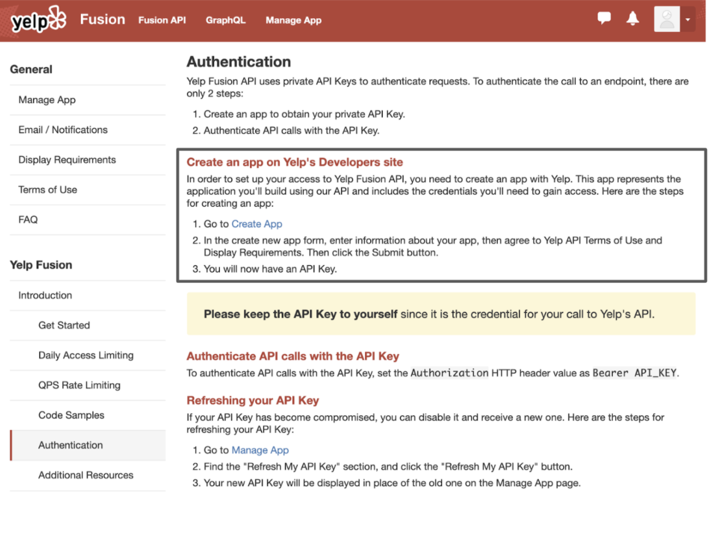
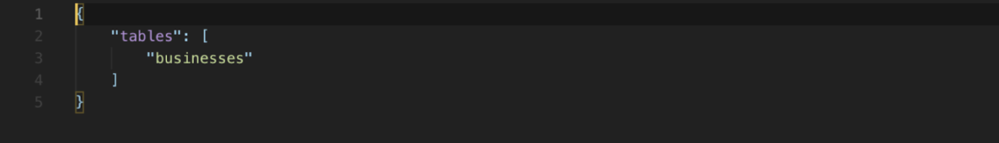
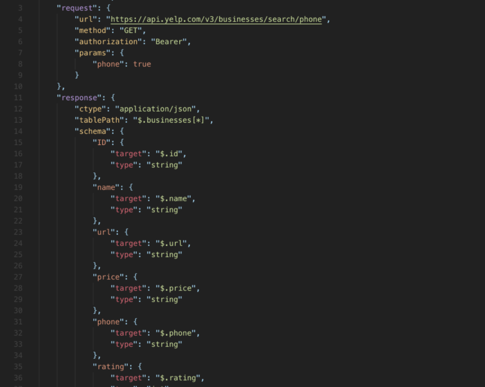
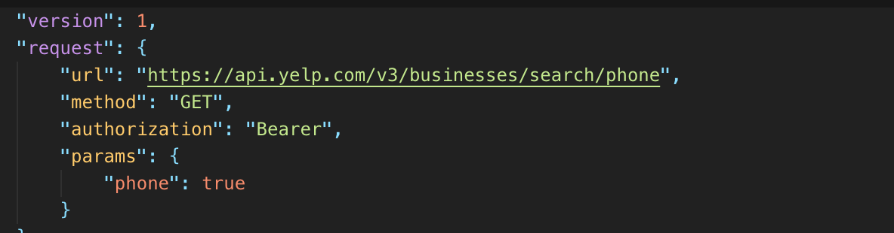
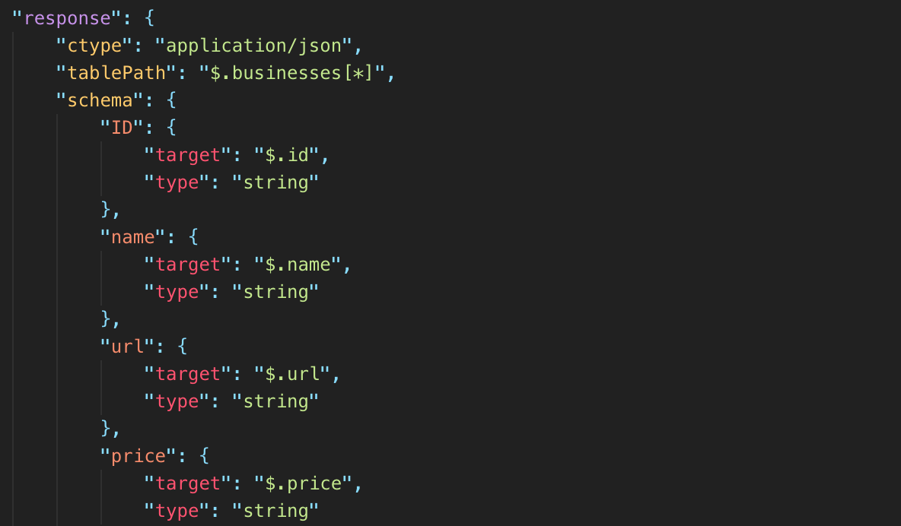
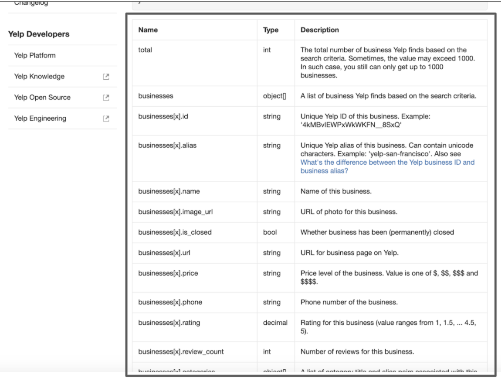
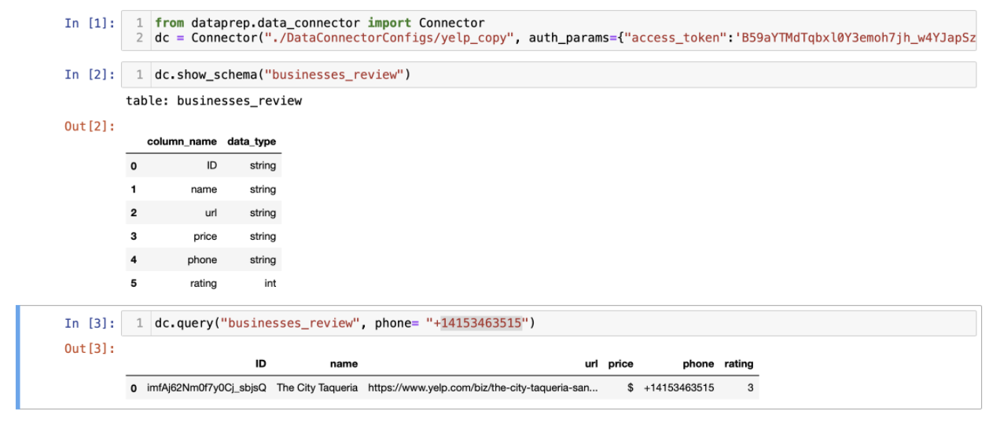

# Welcome to DataPrep.Connector's config repo!

<!-- ALL-CONTRIBUTORS-BADGE:START - Do not remove or modify this section -->

<!-- ALL-CONTRIBUTORS-BADGE:END -->

DataPrep.Connector is an easy-to-use, open-source API wrapper that speeds up development by standardizing calls to multiple APIs as a simple workflow. 

This README is intended for contributors and developers who want to build a configuration file. We will go over how to make a configuration file using Yelp's API as an example.  Specifically, the Yelp API is an API for phone number searches. 

We recommend you read through the Yelp API documentation and review what the available endpoints are at this [link](https://www.yelp.com/developers/documentation/v3/get_started). Even if you are a beginner to APIs, this will help you understand how DataPrep.Connector (and your API) work.

# What is the config file?

DataPrep.Connector enables users who wish to include APIs in their code to do so without worrying about the overhead of learning how to work with each API. 

A **config file** is what DataPrep.Connector needs in order to make these APIs available for users. Contributors like you create these config files (one per API). They include all the nitty gritty details on the API like the auth methods, parameters, schema and more, so that the tool can handle them. This is what allows users to not have to worry about figuring out too many of the specifics of the API when using our tool.

# Getting started

## Understanding API Authorization

Many APIs require **authentication** and **authorization** (often abbreviated as auth). These are how the APIs can 1) track who is invoking API calls and 2) allow them to invoke said API calls. Often, in order to obtain the insturctions, credentials and/or access tokens for these, you have to register a developer account or app with an API. This is usually the first thing you see on the API's documentation.

For example, on the [Yelp API's documentation](https://www.yelp.com/developers/documentation/v3), you can see the Authentication guide linked under the "Introduction" section.

## Obtaining your Auth method

As you can see, for the Yelp API, we must first create and register an app with Yelp. Don't worry, this doesn't mean you need to create an app first. It's just registering a future application. 

Once we do this, we will obtain an **API Key**. It's like your own personal login. Sometimes this will be called a token, or a secret, or soemthing different. **Remember that this key should be treated like a password.** 

 Next, you can see Yelp uses the Bearer auth method. There are multiple methods for auth, and DataPrep.Connector supports the following:

1. OAuth
2. Query Parameter
3. Bearer
4. Header

*Note*: The auth method is how the API chooses to authenticate and authorize its users. An API key, access token, client secret & client ID or whatever else it may be called, is the login you use for this method. For example, for Yelp, we use the Bearer method with an API key.

# Creating the config files
The data connector requires two files to run, meta.json and table.json.

## Create the meta.json file

The meta.json file tells DataPrep.Connector tool how many tables are in the data source and which tables to access. It contains the names of these tables. The meta.json file needs to be manually written.

## Create the [table].json file

Depending on how many tables of data the API provides, you can decide which and how many tables to create. Each of these tables maps to a [table].json file. This [table].json file includes details on how to interact with the API, as well as information on what is returned and passed in.

For example, let's take a look at the Yelp API. It returns businesses with details on the businesses. So it makes sense to create a businesses.json file. Take a look at other config files to get a better sense of the [table].json files.

Let's break down the components of the [table].json file. 

## Top Level
### Request:

Version:
- The version of the config file

URL: "https://api.yelp.com/v3/businesses/search/phone"
- Contains the URL path for invoking the API

method: "GET" 
- GET is used to request (or GET) data from a specified resource. For the Yelp's API request, leave it as GET, since we are retrieving data.

authorization: "Bearer"
- Authorization method used. For Yelp's API request, leave it as Bearer.
    - Note: For other API’s, please read how they may authorize your application. Depending on the method, a different authorization may be required. 

params: {"phone": true}
- Parameters contain the requested information to make the API call. Some parameters might be required, and some may be optional. This will all be in the documentation of your respective API. Each parameter in the config file is a key-value pair where the name is the key and the value is Boolean. If you take a look at the Yelp Phone Search documentation, it shows that phone is a required parameter.
  - A True value refers to the required parameter to query a request. 
  - A False value refers to the optional parameter to query a request. 

### Response:

ctype: "application/json"
- The Content-Type, or ctype, is used to indicate the media type of the resource. A Content-Type header tells the client what the content type of the returned information actually is. With DataPrep.Connector, the content type is application/json. 
  
tablePath: "$.businesses[*]"
- The tablePath always starts with "$". After this, depending on what your API returns as a response to being called, you can build out the remainder. In the case of Yelp, this is what the response looks like:

- it returns a total parameter with how many businesses were found, then an array of businesses, with some info for each business. So our tablePath then becomes $businesses[\*]. The [\*] indicates that it is a dynamic part of the response, and you will clarify what it is in the following schema.

schema: { }
- After finding table content, we look at the schema. Let's break down what the schema looks like for Yelp.
  
id: {"target": "$.id", "type": "string"}
- The schema will be read until all elements of the business array received. ID is at the root of the first row of the business array, and it will access the ID attribute. 
    - The first "id" you write here is what you decide to call the returned value. You could change it to "business_id" if you felt it was more appropriate.  
    - The second "$.id" you see is what is actually returned from the API. This will also always start with a $. As you can see, if we build off of tablePath, this would become "$.businesses[*].id". The [\*] here is what will be changing (the index of the businesses array item). The .id is what is returned every time for each business.

- Build the remainder of the schema in the same way by viewing the same response section of your specific endpoint page that you looked at to create the tablePath.

You can test the config file by passing it to the library: 

# That's all for now!

Please visit the other tutorials and have a look at the other config files that are available if you are interested in setting up a config file.

## Contributors ✨

Thanks goes to these wonderful people ([emoji key](https://allcontributors.org/docs/en/emoji-key)):

<!-- ALL-CONTRIBUTORS-LIST:START - Do not remove or modify this section -->
<!-- prettier-ignore-start -->
<!-- markdownlint-disable -->
<table>
  <tr>
    <td align="center"><a href="http://wooya.me"> <b>Weiyuan Wu</b></a> <a href="https://github.com/sfu-db/DataConnectorConfigs/commits?author=dovahcrow" title="Code">💻</a> <a href="#maintenance-dovahcrow" title="Maintenance">🚧</a></td>
    <td align="center"><a href="http://www.sfu.ca/~peiw/"> <b>peiwangdb</b></a> <a href="https://github.com/sfu-db/DataConnectorConfigs/commits?author=peiwangdb" title="Code">💻</a> <a href="#maintenance-peiwangdb" title="Maintenance">🚧</a></td>
    <td align="center"><a href="https://github.com/nick-zrymiak"> <b>nick-zrymiak</b></a> <a href="https://github.com/sfu-db/DataConnectorConfigs/commits?author=nick-zrymiak" title="Code">💻</a></td>
    <td align="center"><a href="https://www.pallavibharadwaj.com"> <b>Pallavi Bharadwaj</b></a> <a href="https://github.com/sfu-db/DataConnectorConfigs/commits?author=pallavibharadwaj" title="Code">💻</a></td>
    <td align="center"><a href="https://www.linkedin.com/in/hilal-asmat/"> <b>Hilal Asmat</b></a> <a href="https://github.com/sfu-db/DataConnectorConfigs/commits?author=h-asmat" title="Documentation">📖</a></td>
  </tr>
</table>

<!-- markdownlint-enable -->
<!-- prettier-ignore-end -->
<!-- ALL-CONTRIBUTORS-LIST:END -->