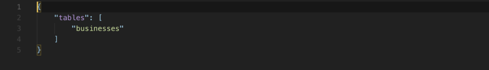
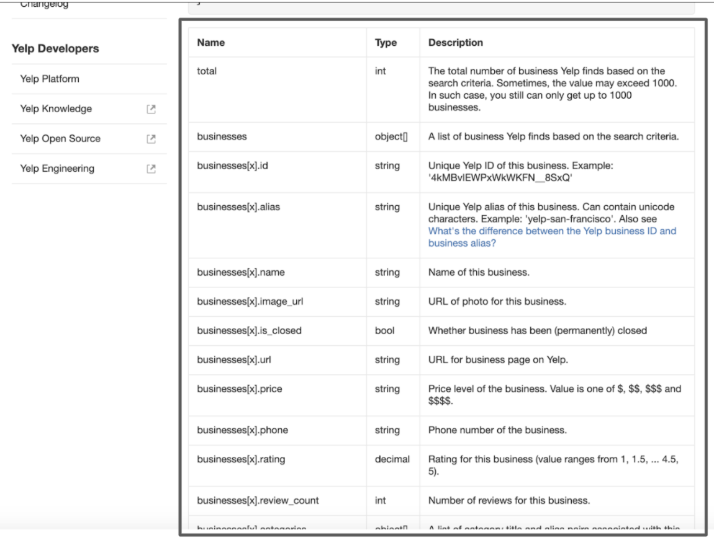

# Data Connector Config File

In this README will be going over how to build your own configuration file with the Yelp API, specifically an API for phone number searches. 

It is recommended to read over the Yelp documentation on the available endpoints and parameters, please visit this [link](https://www.yelp.com/developers/documentation/v3/get_started). 

# Inspecting Endpoints

“Endpoints are communication channels. When an API interacts with another system, they communicate with each other and allows you to match business data on the information you provide.”

When you decide on an endpoint, explore the page. Under the request section, store the information as it will be used to build the config file. 

Explore the parameters section and select the objects that are most useful for your application.

“A parameter is an option that can be passed with the endpoint to influence the response”.

# Obtaining an access token
Obtain the access token by creating a server side application from the Yelp site, please visit this [link](https://www.yelp.com/developers/documentation/v3/authentication). Simply create an app, enter some information about its use and generate a key.

When you created your token, stored the request information and chosen your parameters, it’s time to create the config files. 

# The config files
The data connector requires two files to run, meta.json and table.json.

## Create the meta.json file

A meta object contains non-standard meta-information about a resource that can not be represented as an attribute or relationship.

In our case, it contains the key value of the table and it’s name in an array. It tells the connector how many tables are in the data source and which tables to access. The meta.json file needs to be written manually.

## Create the businesses.json file

The business file contains information needed to communicate with Yelp’s API. In this file there is the request and response section. 

## Top Level
### Request:

URL: "https://api.yelp.com/v3/businesses/search/phone"
- Contains the URL path for the API

method: "GET" 
- GET is used to request data from a specified resource.

authorization: "Bearer"
- Authorization to ensure that client requests access data securely. The Bearer allows requests to authenticate using an access key, such as a token. 

- Note: For other API’s, please read into how a website may authorize your application. Depending on the method, a token may not be needed or a different authorization method may be required. 

Params: {"phone": true}
- Parameters, or Params, contain the criteria that is requested to the API. Prior to creating the config file, the parameters should have been selected. For each parameter  it will be treated as a key where it’s value is Boolean. 
  - A True value refers to the required parameter to query a request. 
  - A False value refers to the optional parameter to query a request. 

### Response:

ctype: "application/json"
- The Content-Type, or ctype, is used to indicate the media type of the resource. A Content-Type header tells the client what the content type of the returned information actually is. With data connector, the contect type application/json.
  
tablePath: "$.businesses[*]"
- This is the field inside that response there is an array and under the array is the table content.

schema: { }
- After finding table content, it looks at schema.
  
rating: {"target": "$.id", "type": "string"}
- ID is at the root of the first row of the business array and will access the id attribute. This will continue until all elements of the business array received.

To build the schema you would need to review the response section of the specific endpoint page. In this example, we are still looking at the Phone Search. 

The user selects the responses they are interested in receiving and sets them up in the appropriate format. Take a look at the response section of the page. The target is the response name and the type is data format response generated. 

Once the user sets up the appropriate responses in the Json file then the user can start using data connector. 

# That's all for now.

Please visit the other tutorials that are available if you are interested in setting up a data connector.

